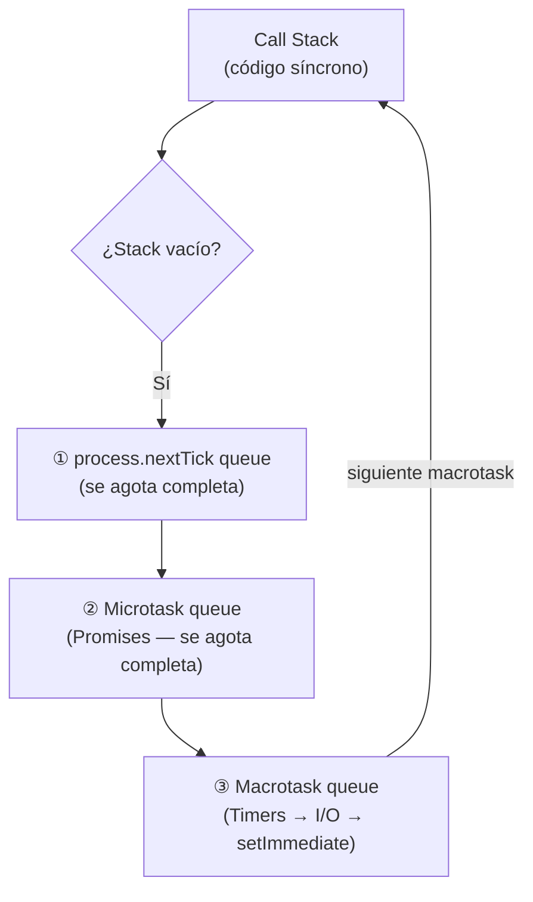
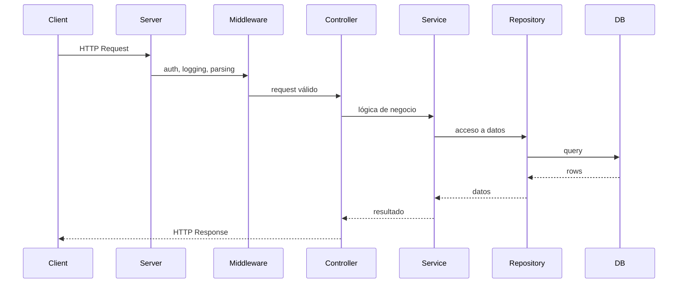
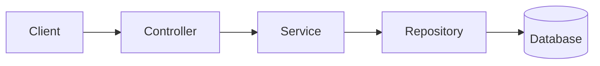
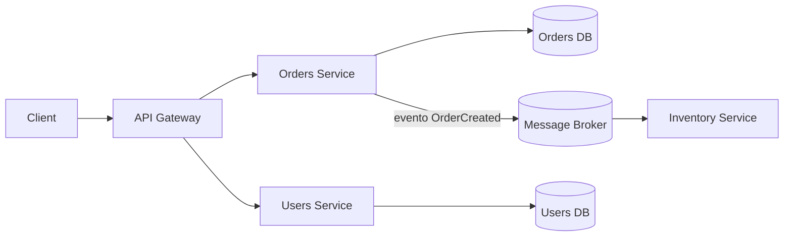
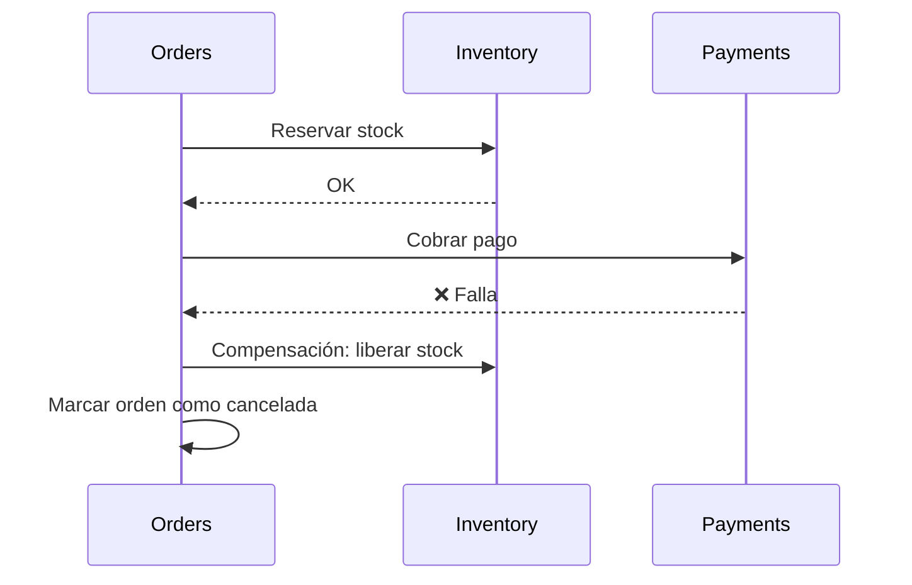
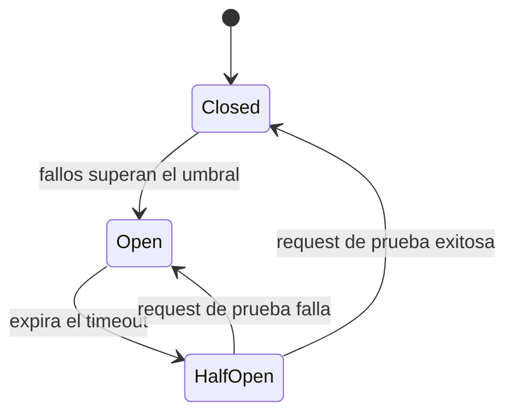
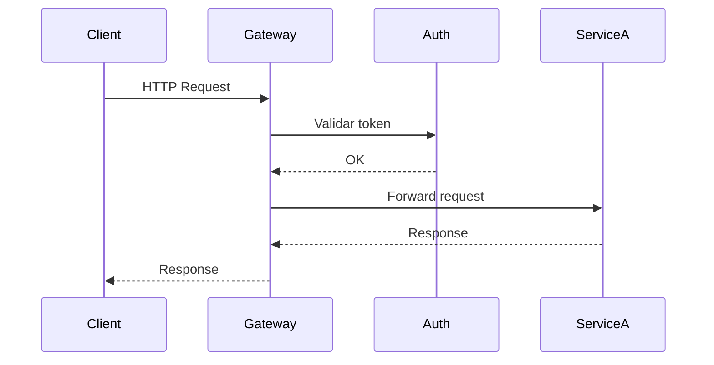
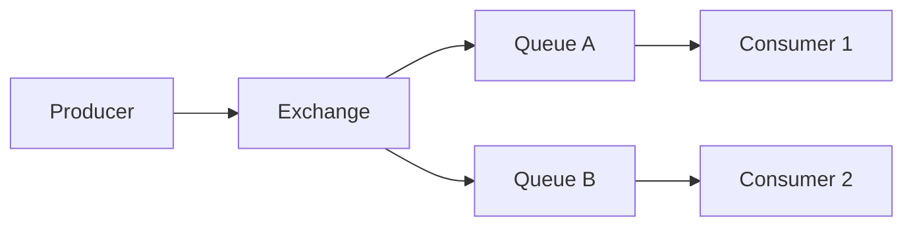
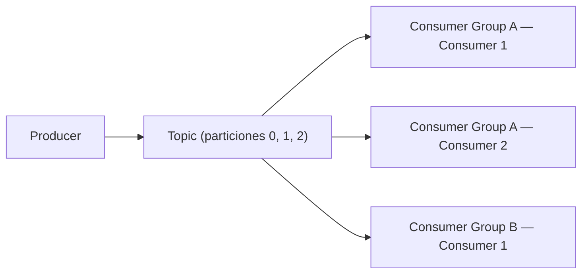
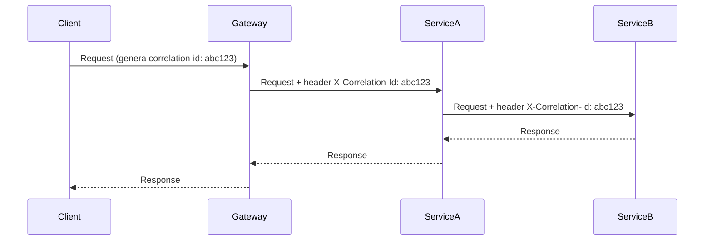

# 🦍 Guía de Preparación — Backend Developer (Node.js · JavaScript · SQL · Microservicios)


> Guía de estudio profesional para una entrevista técnica de **Backend Developer — Node.js, JavaScript, SQL y Microservicios**. Cada concepto se explica con una definición precisa, por qué importa en la práctica, y ejemplos de código cuando aportan valor.

### Cómo leer cada concepto

| Símbolo | Significado |
|:---:|---|
| **Definición** | Explicación corta y precisa |
| 💡 | Por qué importa / contexto práctico |
| 🧩 | Ejemplo de código |
| ❌ / ✅ | Mala práctica vs. buena práctica |
| 🔥 | Nivel de prioridad de estudio (1 a 5) |

---

## 🎯 Prioridad de Estudio

<table>
<tr><th>🔴 Alta</th><th>🟡 Media</th><th>🟢 Baja</th></tr>
<tr valign="top">
<td>

Node.js · JavaScript (closures, event loop, asincronía) · HTTP · REST · SQL (joins, transacciones, ACID) · Concurrencia · Diseño de APIs · Autenticación (JWT, hashing) · Docker (básico) · Microservicios (comunicación, resiliencia, consistencia)

</td>
<td>

NoSQL/Redis · Arquitectura backend (SOLID, capas) · Message Brokers (RabbitMQ/Kafka) · Testing · Observabilidad · Patrones de diseño backend · Performance

</td>
<td>

Kubernetes avanzado · Event Sourcing · CQRS a fondo · Sharding/replication de bajo nivel · Internals de V8/libuv

</td>
</tr>
</table>

---

## Tabla de Contenidos

| | | |
|---|---|---|
| 1. [JavaScript — Fundamentos](#1-javascript--fundamentos) | 8. [NoSQL y Redis](#8-nosql-y-redis) | 15. [Performance](#15-performance) |
| 2. [JavaScript — Asincronía](#2-javascript--asincronía) | 9. [Arquitectura Backend](#9-arquitectura-backend) | 16. [Sistemas Distribuidos](#16-sistemas-distribuidos) |
| 3. [Node.js](#3-nodejs) | 10. [Microservicios](#10-microservicios) | 17. [Patrones de Diseño Backend](#17-patrones-de-diseño-para-backend) |
| 4. [Backend Fundamentals](#4-backend-fundamentals) | 11. [Message Brokers](#11-message-brokers) | 18. [🔥 Node.js — Fundamentos clave](#18-nodejs--fundamentos-clave) |
| 5. [APIs](#5-apis) | 12. [Docker y Deployment](#12-docker-y-deployment) | 19. [🔥 Microservicios — Fundamentos clave](#19-microservicios--fundamentos-clave) |
| 6. [Autenticación y Seguridad](#6-autenticación-y-seguridad) | 13. [Testing](#13-testing) | 20. [Tablas Comparativas](#20-tablas-comparativas) |
| 7. [SQL y Bases Relacionales](#7-sql-y-bases-de-datos-relacionales) | 14. [Observabilidad](#14-observabilidad) | 21. [Checklist de Estudio](#21-checklist-de-estudio) |

---

# 1. JavaScript — Fundamentos

*Scope, tipos, funciones y el modelo de objetos de JavaScript — la base sobre la que se construye todo lo demás.*

## 1.1 Variables y Scope

### `var` vs `let` vs `const`

**Definición:** tres formas de declarar variables, con distinto *scope* y comportamiento de reasignación.

> 💡 Es la base de casi todo el razonamiento sobre closures, loops y hoisting — entender bien esto evita errores en cascada en el resto del código.

```javascript
var a = 1;    // scope de función, redeclarable y reasignable
let b = 2;    // scope de bloque, reasignable, NO redeclarable
const c = 3;  // scope de bloque, NO reasignable (el binding, no el contenido)

const obj = { x: 1 };
obj.x = 2; // ✅ válido — const protege la referencia, no el contenido
```

| Concepto | Comportamiento | Cuándo usar |
|---|---|---|
| `var` | Scope de función, hoisting a `undefined`, redeclarable | Evitar en código moderno |
| `let` | Scope de bloque, reasignable, TDZ | Variables que cambian de valor |
| `const` | Scope de bloque, no reasignable, TDZ | Default recomendado |

**🔥🔥🔥🔥🔥**

### Tipos de Scope

| Tipo | Qué es |
|---|---|
| **Global Scope** | Visible en todo el programa |
| **Function Scope** | Visible solo dentro de la función (`var`) |
| **Block Scope** | Visible solo dentro de `{ }` (`let`/`const`) |
| **Lexical Scope** | El scope se determina por dónde se **escribe** el código, no por dónde se ejecuta — es lo que hace posibles los closures |

### Hoisting y Temporal Dead Zone (TDZ)

**Definición:** el *hoisting* es el comportamiento donde las declaraciones se procesan antes de ejecutar el código línea a línea. La *TDZ* es el período entre el inicio del scope y la línea donde `let`/`const` se declaran, durante el cual la variable existe pero no puede usarse.

```javascript
console.log(typeof foo); // "function" — las function declarations se hoistean completas
function foo() {}

console.log(bar); // undefined — var se hoistea con valor undefined
var bar = 1;

console.log(baz); // ReferenceError — TDZ
let baz = 2;
```

**🔥🔥🔥🔥🔥**

---

## 1.2 Tipos de Datos

| Tipo | Categoría | Notas |
|---|---|---|
| `string`, `number`, `boolean` | Primitivo | Copia por valor |
| `null` | Primitivo | Ausencia de valor **intencional** |
| `undefined` | Primitivo | Variable declarada sin asignar / parámetro no pasado |
| `Symbol` | Primitivo | Valor único e inmutable, usado como clave de propiedad sin riesgo de colisión |
| `BigInt` | Primitivo | Enteros de precisión arbitraria, más allá de `Number.MAX_SAFE_INTEGER` (`10n`) |
| `object`, `array`, `function` | Referencia | Copia por referencia (puntero compartido) |

### Primitivos vs Referencia

> 💡 Explica por qué mutar un objeto "compartido" afecta a otras variables, y es la base de shallow vs deep copy.

```javascript
let a = 5; let b = a; b = 10;
console.log(a); // 5 — copia por valor

let obj1 = { x: 1 }; let obj2 = obj1; obj2.x = 99;
console.log(obj1.x); // 99 — misma referencia en memoria
```

**🔥🔥🔥🔥🔥**

### `null`, `undefined`, `NaN`, Truthy/Falsy

**Valores falsy:** `false, 0, -0, 0n, "", null, undefined, NaN`. Todo lo demás es truthy (incluyendo `[]` y `{}`).

```javascript
console.log(typeof null);      // "object" — bug histórico de JS, nunca corregido
console.log(typeof undefined); // "undefined"
console.log(NaN === NaN);      // false — usar Number.isNaN(x)
console.log(Boolean([]));      // true — un array vacío es truthy
```

**🔥🔥🔥🔥**

---

## 1.3 Igualdad: `==` vs `===`

**Definición:** `==` compara con **coerción de tipos**; `===` compara **tipo y valor** sin conversión.

```javascript
console.log(1 == "1");          // true  (coerción: "1" → 1)
console.log(1 === "1");         // false
console.log(null == undefined); // true  (única excepción "especial" del lenguaje)
```

| Operador | Comportamiento | Cuándo usar |
|---|---|---|
| `==` | Compara con coerción de tipos | Prácticamente nunca en producción |
| `===` | Compara tipo y valor, sin coerción | Siempre — es el default recomendado |

**🔥🔥🔥🔥🔥**

---

## 1.4 Funciones

### Function Declaration vs Expression vs Arrow Function

| Tipo | Hoisting | `this` propio | Uso recomendado |
|---|---|---|---|
| Function declaration | Se hoistea completa | Sí (dinámico) | Funciones de nivel superior |
| Function expression | Solo la variable se hoistea | Sí | Asignación condicional |
| Arrow function | Solo la variable se hoistea | No — hereda `this` léxico | Callbacks, métodos que necesitan `this` externo |

```javascript
saluda(); // ✅ funciona — hoisting completo
function saluda() { console.log("hola"); }

saludaExpr(); // ❌ TypeError
var saludaExpr = function () { console.log("hola"); };
```

**🔥🔥🔥🔥**

### Callback Functions y Higher-Order Functions

**Definición:** una *callback* es una función pasada como argumento a otra para ejecutarse después. Una *higher-order function* recibe y/o retorna funciones (`map`, `filter`, middlewares, decoradores).

### Funciones Puras y Side Effects

**Definición:** una función pura, dado el mismo input, siempre retorna el mismo output y no modifica nada fuera de su scope (sin I/O, sin mutar parámetros, sin depender de estado externo mutable).

> 💡 Las funciones puras son más fáciles de testear (sin mocks de estado externo) y seguras de ejecutar en paralelo.

```javascript
// ❌ Impura: muta el array recibido y depende de Date.now()
function addTimestamp(arr) { arr.push(Date.now()); return arr; }

// ✅ Pura: no muta el input, resultado depende solo de los argumentos
function addItem(arr, item) { return [...arr, item]; }
```

**🔥🔥🔥**

### Recursion

**Definición:** una función que se llama a sí misma hasta alcanzar un caso base.

```javascript
function factorial(n) { return n <= 1 ? 1 : n * factorial(n - 1); }
```

⚠️ Sin caso base correcto → `RangeError: Maximum call stack size exceeded`.

### IIFE (Immediately Invoked Function Expression)

```javascript
(function () { const privado = "no accesible fuera"; console.log(privado); })();
```

Se usaba para encapsular variables antes de que existieran módulos/`let`/`const`, evitando contaminar el scope global.

**🔥🔥**

---

## 1.5 Closures

**Definición:** una función "recuerda" el entorno léxico en el que fue creada, incluso después de que ese entorno haya terminado de ejecutarse.

> 💡 Es probablemente el concepto de JS más aplicado en entrevistas backend: contadores, memoización, módulos privados, y el bug clásico de `var` dentro de loops con callbacks asíncronos.

```javascript
function createCounter() {
  let count = 0; // "atrapada" en el closure
  return function () { return ++count; };
}
const counter = createCounter();
console.log(counter()); // 1
console.log(counter()); // 2 — recuerda el estado entre llamadas
```

```javascript
// ❌ con var, las 3 funciones comparten la misma i (termina en 3)
for (var i = 0; i < 3; i++) { setTimeout(() => console.log(i), 0); } // 3, 3, 3

// ✅ con let, cada iteración crea un binding de bloque nuevo
for (let i = 0; i < 3; i++) { setTimeout(() => console.log(i), 0); } // 0, 1, 2
```

**🔥🔥🔥🔥🔥**

---

## 1.6 Destructuring, Spread/Rest, Template Literals, Optional Chaining, Nullish Coalescing

```javascript
const { a, b = 10, ...rest } = { a: 1, c: 2, d: 3 };
console.log(a, b, rest); // 1 10 { c: 2, d: 3 }

function sum(...nums) { return nums.reduce((acc, n) => acc + n, 0); } // rest
const merged = [...[1, 2], ...[3, 4]]; // spread

const name = "Node";
console.log(`Hola, ${name}!`); // template literal
```

### Optional chaining (`?.`) y Nullish coalescing (`??`)

> 💡 Confundir `??` con `||` es el error más frecuente al definir valores por defecto cuando `0` o `""` son resultados legítimos.

```javascript
const user = { profile: null };
console.log(user.profile?.name); // undefined, no lanza error

const count = 0;
console.log(count || 10); // ❌ 10 — bug si 0 es un valor válido
console.log(count ?? 10); // ✅ 0  — correcto, 0 no es null/undefined
```

### Ternario y Short-circuit Evaluation

```javascript
const label = isActive ? "activo" : "inactivo"; // ternario
const value = input || "default";                // short-circuit con ||
const safe = config && config.value;              // short-circuit con &&
```

**🔥🔥🔥🔥**

---

## 1.7 `this`, `call`, `apply`, `bind`

**Definición:** el valor de `this` depende de **cómo se llama una función**, no de dónde se define (excepto en arrow functions, que heredan `this` léxicamente).

| Método | Ejecuta inmediatamente | Argumentos | Retorna |
|---|---|---|---|
| `fn.call(thisArg, a, b)` | Sí | Separados por comas | El resultado de `fn` |
| `fn.apply(thisArg, [a, b])` | Sí | Como array | El resultado de `fn` |
| `fn.bind(thisArg, a, b)` | No | Separados por comas | Una **nueva función** con `this` fijo |

```javascript
const obj = {
  name: "Node",
  regular: function () { return this.name; },
  arrow: () => { return this.name; },
};
console.log(obj.regular()); // "Node"
console.log(obj.arrow());   // undefined — hereda el this del módulo, no de obj
```

**🔥🔥🔥🔥🔥**

---

## 1.8 Prototypes, Clases y Herencia

### Prototype Chain

**Definición:** cada objeto tiene un enlace interno `[[Prototype]]` hacia otro objeto, del cual "hereda" propiedades/métodos. El motor sube por la cadena hasta `null` al buscar una propiedad.

```javascript
function Animal(name) { this.name = name; }
Animal.prototype.speak = function () { return `${this.name} hace un sonido`; };
const dog = new Animal("Rex");
console.log(dog.speak()); // vive en el prototipo, compartido por todas las instancias
```

### Classes, Inheritance, Encapsulation, Polymorphism

```javascript
class Animal {
  #energy = 100; // encapsulation: campo privado, inaccesible desde fuera

  constructor(name) { this.name = name; }
  speak() { return `${this.name} hace un sonido`; }
}

class Dog extends Animal {       // inheritance
  speak() { return `${this.name} ladra`; } // polymorphism: misma interfaz, comportamiento distinto
}

[new Animal("Genérico"), new Dog("Rex")].forEach(a => console.log(a.speak()));
```

| Pilar OOP | Qué es |
|---|---|
| **Encapsulation** | Ocultar el estado interno (`#campo`) y exponer solo lo necesario |
| **Inheritance** | Una clase reutiliza/extiende el comportamiento de otra (`extends`) |
| **Polymorphism** | Distintas clases responden al mismo método de forma diferente |

**🔥🔥🔥**

---

## 1.9 Módulos: CommonJS vs ES Modules

| Concepto | CommonJS | ES Modules (ESM) |
|---|---|---|
| Sintaxis | `require()` / `module.exports` | `import` / `export` |
| Carga | Síncrona | Análisis estático, soporta carga asíncrona |
| Activación | Default en `.js` | Requiere `"type": "module"` o `.mjs` |

```javascript
exports = { hello: () => "hi" };      // ❌ rompe la referencia — NO se exporta
module.exports.world = () => "world"; // ✅ correcto
```

**🔥🔥🔥🔥**

---

## 1.10 Inmutabilidad, Shallow Copy, Deep Copy

**Definición:** copiar un objeto con spread (`{...obj}`) u `Object.assign` solo copia el **primer nivel** (*shallow copy*); una *deep copy* copia recursivamente todos los niveles.

```javascript
const original = { a: 1, nested: { b: 2 } };
const shallow = { ...original };
shallow.nested.b = 99;
console.log(original.nested.b); // 99 — el spread solo copió el primer nivel

const deep = structuredClone(original); // deep copy nativo (Node 17+)
deep.nested.b = 1;
console.log(original.nested.b); // sigue en 99
```

**🔥🔥🔥🔥🔥**

---

## 1.11 Garbage Collection y Memory Management

**Definición:** JS libera automáticamente la memoria de objetos sin ninguna referencia activa. Un *memory leak* ocurre cuando se mantienen referencias vivas a objetos innecesarios (closures con datos grandes, listeners no removidos, caches sin límite).

```javascript
// ❌ cache crece indefinidamente — nunca se libera memoria
const cache = {};
app.get('/data/:id', (req, res) => {
  if (!cache[req.params.id]) cache[req.params.id] = fetchExpensiveData(req.params.id);
  res.json(cache[req.params.id]);
});
```

**🔥🔥🔥🔥**

---

## 1.12 Arrays

| Método | Retorna | Muta el original | Uso típico |
|---|---|---|---|
| `map` | Nuevo array, misma longitud | No | Transformar cada elemento |
| `filter` | Nuevo array, longitud ≤ original | No | Seleccionar elementos |
| `reduce` | Un valor acumulado | No | Totales, agrupaciones |
| `find` / `findIndex` | Primer match / índice | No | Buscar un elemento |
| `some` / `every` | `boolean` | No | ¿Alguno / todos cumplen? |
| `includes` | `boolean` | No | ¿Existe este valor? |
| `sort` | El mismo array, ordenado | **Sí** | Ordenar — ⚠️ sin comparador ordena como strings |
| `forEach` | `undefined` | No (vía callback sí puede) | Iterar con side effects |
| `flat(n)` / `flatMap` | Array aplanado | No | Aplanar arrays anidados |

```javascript
[].reduce((acc, n) => acc + n); // ❌ TypeError: Reduce of empty array with no initial value
console.log([10, 2, 1].sort()); // ["1", "10", "2"] — ordena como string por defecto
console.log([10, 2, 1].sort((a, b) => a - b)); // [1, 2, 10] — orden numérico correcto
```

**🔥🔥🔥🔥🔥**

---

## 1.13 Objetos

```javascript
const user = { id: 1, name: "Ana" };
Object.keys(user);    // ["id", "name"]
Object.values(user);  // [1, "Ana"]
Object.entries(user); // [["id", 1], ["name", "Ana"]]
Object.assign({}, user, { name: "Luis" }); // shallow merge
Object.freeze(user);  // impide agregar/eliminar/reasignar props de primer nivel (shallow)
```

**🔥🔥🔥**

---

# 2. JavaScript — Asincronía

*Cómo JavaScript ejecuta código no bloqueante: Promises, async/await y el Event Loop.*

## 2.1 Síncrono vs Asíncrono

**Definición:** código **síncrono** bloquea la ejecución hasta terminar; código **asíncrono** permite que el programa siga mientras una operación (I/O, timer, red) se completa en segundo plano.

**Evolución del lenguaje:** **callbacks** → **Promises** (objeto que representa un valor futuro) → **async/await** (azúcar sintáctico sobre Promises).

```javascript
// Callback (estilo Node: error-first)
fs.readFile("file.txt", "utf8", (err, data) => { if (err) return console.error(err); console.log(data); });

// Promise
fetchUser(1).then(user => console.log(user)).catch(err => console.error(err));

// async/await — mismo comportamiento, más legible
async function run() {
  try { const user = await fetchUser(1); console.log(user); }
  catch (err) { console.error(err); }
}
```

**🔥🔥🔥🔥🔥**

---

## 2.2 Promises

**Definición:** un objeto que representa el resultado eventual (éxito o fallo) de una operación asíncrona.

| Estado | Significa |
|---|---|
| `pending` | Aún no se resolvió ni rechazó |
| `fulfilled` | Se resolvió con éxito (`resolve(value)`) |
| `rejected` | Falló (`reject(error)`) |

`.then()` maneja el éxito, `.catch()` el error, `.finally()` corre siempre. Se pueden encadenar (*Promise chaining*) porque `.then()` retorna una nueva Promise.

### Promise Combinators

| Método | Resuelve con | Rechaza cuando | Cuándo usar |
|---|---|---|---|
| `Promise.all` | Array con todos los valores | **Cualquiera** rechaza (fail-fast) | Necesitas TODOS los resultados |
| `Promise.allSettled` | Array de `{status, value/reason}` | Nunca rechaza | Necesitas el resultado de todas, aunque algunas fallen |
| `Promise.race` | El primero en resolver **o** rechazar | — | Necesitas la más rápida (ej. timeout) |
| `Promise.any` | El primero en **resolver** | Solo si **todas** rechazan (`AggregateError`) | Primera fuente exitosa, de varias redundantes |

```javascript
const p1 = Promise.resolve(1);
const p2 = new Promise((_, rej) => setTimeout(() => rej("fail"), 10));
const p3 = Promise.resolve(3);

Promise.all([p1, p2, p3]).catch(e => console.log("all:", e));               // "all: fail"
Promise.allSettled([p1, p2, p3]).then(r => console.log(r.map(x => x.status))); // ['fulfilled','rejected','fulfilled']
Promise.race([p1, p2, p3]).then(v => console.log("race:", v));              // "race: 1"
Promise.any([p1, p2, p3]).then(v => console.log("any:", v));                // "any: 1"
```

**🔥🔥🔥🔥🔥**

---

## 2.3 Ejecución Secuencial vs Paralela ⚠️

**Definición:** usar `await` uno tras otro ejecuta operaciones **en serie** (el tiempo total se suma); usar `Promise.all` las lanza **en paralelo** (el tiempo total es el de la más lenta).

> 💡 Es un error de rendimiento real y muy común en código de producción — detectarlo demuestra criterio de ingeniería senior.

```javascript
// ❌ SECUENCIAL — ~2s si cada fetch tarda 1s y son independientes
async function sequential() { const a = await fetchA(); const b = await fetchB(); return [a, b]; }

// ✅ PARALELO — ~1s, ambas inician al mismo tiempo
async function parallel() { const [a, b] = await Promise.all([fetchA(), fetchB()]); return [a, b]; }
```

**🔥🔥🔥🔥🔥**

### `forEach` con `async`/`await` — error clásico

```javascript
// ❌ orders siempre queda vacío: forEach no espera callbacks async
async function getUserOrders(userId) {
  const orders = [];
  const ids = await getOrderIds(userId);
  ids.forEach(async (id) => { orders.push(await getOrderById(id)); });
  return orders;
}

// ✅ solución: Promise.all con map
async function getUserOrders(userId) {
  const ids = await getOrderIds(userId);
  return Promise.all(ids.map(id => getOrderById(id)));
}
```

**🔥🔥🔥🔥🔥**

---

## 2.4 Manejo de Errores Asíncronos

```javascript
// ❌ el catch NO atrapa el rechazo — falta await
async function run() {
  try { Promise.reject(new Error("boom")); }
  catch (e) { console.log("caught"); } // nunca se ejecuta
}

// ✅ correcto
async function run() {
  try { await Promise.reject(new Error("boom")); }
  catch (e) { console.log("caught"); } // sí se ejecuta
}
```

`try/catch` solo captura rechazos de promesas que son `await`-adas (o encadenadas con `.catch()`); sin eso, el resultado es un `UnhandledPromiseRejection`.

**🔥🔥🔥🔥🔥**

---

## 2.5 Event Loop

**Definición:** el mecanismo que permite a JS (single-threaded) manejar operaciones asíncronas. El **Call Stack** ejecuta código síncrono. Las operaciones asíncronas (timers, I/O, requests) se delegan a **Web APIs**/libuv, y sus callbacks se encolan: Promises en la **Microtask Queue**, `setTimeout`/I/O/`setImmediate` en la **Macrotask (Callback) Queue**. `process.nextTick` (específico de Node) tiene su propia cola, con **la mayor prioridad de todas**.



```javascript
console.log("A");
setTimeout(() => console.log("B"), 0);          // macrotask
process.nextTick(() => console.log("C"));       // máxima prioridad
Promise.resolve().then(() => console.log("D")); // microtask
console.log("E");
// Orden de ejecución: A, E, C, D, B
```

### Ejemplos de orden de ejecución

```javascript
// Ejemplo 1 — setImmediate siempre es macrotask (fase check), corre al final
setImmediate(() => console.log('immediate'));
process.nextTick(() => console.log('nextTick'));
Promise.resolve().then(() => console.log('promise'));
console.log('sync');
// → sync, nextTick, promise, immediate
```

```javascript
// Ejemplo 2 — el executor de una Promise corre SÍNCRONAMENTE; solo .then() es asíncrono
console.log('A');
new Promise((resolve) => { console.log('B'); resolve(); }).then(() => console.log('C'));
console.log('D');
// → A, B, D, C
```

```javascript
// Ejemplo 3 — una función async siempre retorna una Promise, su .then() es microtask
async function foo() { return 1; }
foo().then(console.log);
console.log('sync');
// → sync, 1
```

**🔥🔥🔥🔥🔥**

---

## 2.6 Race Conditions

**Definición:** un bug causado por el orden/timing impredecible de operaciones concurrentes.

```javascript
// ❌ dos requests leen balance=100 antes de que la primera reste su monto
let balance = 100;
async function withdraw(amount) {
  if (amount <= balance) {
    await simulateDbCall();
    balance -= amount; // ambas pasan la validación → balance termina negativo
  }
}
```

**Solución:** locking (pessimistic/optimistic) o una transacción `Serializable` — ver [sección 7.7](#77-concurrencia-locking-e-isolation-levels).

**🔥🔥🔥🔥**

---

# 3. Node.js

*El runtime, su modelo de concurrencia y las herramientas operativas que lo rodean.*

## 3.1 Qué es Node.js — V8, libuv, Event-Driven, Non-Blocking I/O

**Definición:** Node.js es un runtime de JavaScript construido sobre el motor **V8** de Google, que permite ejecutar JS fuera del navegador. **libuv** es la librería en C++ que le da a Node su **Event Loop**, I/O no bloqueante, y un **thread pool** interno (4 hilos por defecto).

> 💡 **Si Node es single-threaded, ¿cómo maneja miles de conexiones simultáneas?** Node ejecuta tu código JavaScript en un solo hilo (el Event Loop), pero las operaciones de I/O (red, disco, DNS, parte de `crypto`/`zlib`) se delegan al sistema operativo o al thread pool de libuv, que trabaja en paralelo. Cuando una operación termina, su callback se encola de vuelta al Event Loop. Por eso Node puede manejar miles de conexiones concurrentes con un solo hilo de JS: casi todo el tiempo ese hilo está **esperando I/O**, no computando.

```javascript
// ✅ I/O-bound — no bloquea el Event Loop, otras requests se siguen atendiendo
app.get('/user/:id', async (req, res) => {
  const user = await db.query('SELECT * FROM users WHERE id = $1', [req.params.id]);
  res.json(user);
});

// ❌ CPU-bound síncrono — bloquea el Event Loop, TODAS las requests se congelan
app.get('/report', (req, res) => { res.json(generateHugeReportSync(data)); });
```

**🔥🔥🔥🔥🔥**

## 3.2 Single Thread, Thread Pool, Worker Threads, Cluster

| Concepto | Qué es |
|---|---|
| **CPU-bound** | Tarea limitada por cómputo (cálculos pesados) — bloquea el hilo si es síncrona |
| **I/O-bound** | Tarea limitada por esperar una respuesta externa — no bloquea, se delega |
| **Thread Pool** | Hilos internos de libuv (default 4) usados para FS, DNS, parte de `crypto` |
| **`cluster`** | Bifurca múltiples **procesos** Node (memoria separada) para usar varios núcleos |
| **`worker_threads`** | Crea hilos dentro del **mismo proceso**, pueden compartir memoria — ideal para CPU-bound |

Confundir "single-threaded" con "no puede manejar concurrencia" es el error conceptual más común: Node maneja concurrencia de I/O excelentemente, pero no paraleliza cómputo por sí solo.

**🔥🔥🔥🔥🔥**

## 3.3 Streams y Buffers

**Definición:** un `Buffer` almacena datos binarios crudos. Los *streams* procesan datos **por partes (chunks)** en vez de cargarlos completos en memoria.

| Tipo de stream | Qué hace |
|---|---|
| `Readable` | Fuente de datos (ej. leer un archivo) |
| `Writable` | Destino de datos (ej. escribir a un archivo o response HTTP) |
| `Duplex` | Ambos (ej. un socket TCP) |
| `Transform` | Duplex que modifica los datos al pasar (ej. compresión) |

**Backpressure:** cuando el destino (`Writable`) no procesa tan rápido como el `Readable` produce, el stream pausa automáticamente la lectura — evita saturar la memoria.

```javascript
// ✅ uso de memoria constante, sin importar el tamaño del archivo
fs.createReadStream('archivo-grande.csv').pipe(res);

// ❌ carga el archivo COMPLETO en memoria antes de enviarlo
res.send(fs.readFileSync('archivo-grande.csv'));
```

**🔥🔥🔥🔥**

## 3.4 File System, `process`, Variables de Entorno

```javascript
process.env.NODE_ENV;        // variables de entorno
process.argv;                 // argumentos de línea de comandos
process.pid;                  // PID del proceso
process.on('SIGTERM', () => { /* graceful shutdown */ });
```

**Environment variables:** configuración externa al código (credenciales, URLs, flags) — nunca hardcodear secretos en el código fuente.

**🔥🔥🔥🔥**

## 3.5 `package.json`, npm/pnpm, Semantic Versioning

`dependencies` = necesarias en producción. `devDependencies` = solo desarrollo (testing, linters, build tools).

**Semantic Versioning (`MAJOR.MINOR.PATCH`):**
- `^1.2.3` → acepta actualizaciones de `MINOR`/`PATCH` (hasta `<2.0.0`).
- `~1.2.3` → acepta solo actualizaciones de `PATCH` (hasta `<1.3.0`).

| | `npm install` | `npm ci` |
|---|---|---|
| Lee | `package.json` (puede actualizar lockfile) | Solo `package-lock.json` |
| `node_modules` previo | Lo actualiza incrementalmente | Lo borra primero, instala limpio |
| Uso recomendado | Desarrollo local | Pipelines de CI/CD |

**pnpm:** alternativa a npm que usa un store global con symlinks — instalaciones más rápidas y `node_modules` más liviano, evitando duplicar paquetes entre proyectos.

**🔥🔥🔥**

## 3.6 Manejo de Errores: Uncaught Exceptions y Unhandled Rejections

```javascript
process.on('uncaughtException', (err) => {
  console.error('Excepción no capturada:', err);
  process.exit(1); // el proceso queda en estado indefinido — debe reiniciarse
});

process.on('unhandledRejection', (reason) => {
  console.error('Promise rechazada sin catch:', reason);
});
```

La práctica recomendada ante un `uncaughtException` es loguear y salir (`process.exit(1)`), dejando que un orquestador (PM2, Kubernetes) reinicie el proceso — no intentar "seguir como si nada", porque el estado interno puede estar corrupto.

**🔥🔥🔥🔥**

## 3.7 Graceful Shutdown: `SIGTERM` y `SIGINT`

**Definición:** antes de terminar el proceso, cerrar conexiones activas (DB, HTTP) de forma ordenada, sin cortar requests en curso.

```javascript
process.on('SIGTERM', async () => {
  server.close(() => { db.disconnect(); process.exit(0); });
});
```

| Señal | Origen típico |
|---|---|
| `SIGTERM` | Orquestador pidiendo apagado ordenado (ej. Kubernetes antes de matar un pod) |
| `SIGINT` | `Ctrl+C` en terminal |

Kubernetes envía `SIGTERM` y espera un período de gracia antes de forzar `SIGKILL` — sin manejarlo, las requests en vuelo se cortan abruptamente en vez de completarse.

**🔥🔥🔥🔥**

## 3.8 Módulos Built-in de Node

`fs`, `http`/`https`, `path`, `os`, `crypto`, `events` (`EventEmitter`), `stream`, `child_process`, `util`.

`'error'` es un evento especial en `EventEmitter`: si se emite sin ningún listener registrado, Node lanza la excepción y puede tumbar el proceso.

**🔥🔥🔥**

---

# 4. Backend Fundamentals

*Los conceptos de HTTP, REST y escalabilidad que sostienen cualquier API, sin importar el framework.*

## 4.1 Client-Server, Request/Response, HTTP/HTTPS

**Anatomía de una request/response:** método + URL (*path params* `/users/:id`, *query params* `?page=2`) + headers + body → el servidor responde con status code + headers + body. **HTTPS** cifra el tráfico en tránsito (TLS) — sin él, cualquier dato, incluidos tokens, viaja en texto plano.



## 4.2 HTTP Methods y Status Codes

| Método | Idempotente | Uso |
|---|---|---|
| GET | ✅ | Leer |
| POST | ❌ | Crear |
| PUT | ✅ | Reemplazar completo |
| PATCH | ⚠️ No garantizado | Actualización parcial |
| DELETE | ✅ | Eliminar |

| Código | Nombre | Cuándo usarlo |
|---|---|---|
| 200 | OK | Éxito general |
| 201 | Created | Recurso creado |
| 204 | No Content | Éxito sin cuerpo (DELETE) |
| 400 | Bad Request | Sintaxis inválida |
| 401 | Unauthorized | No autenticado |
| 403 | Forbidden | Autenticado, sin permisos |
| 404 | Not Found | El recurso no existe |
| 409 | Conflict | Conflicto de estado |
| 422 | Unprocessable Entity | Datos semánticamente inválidos |
| 429 | Too Many Requests | Rate limiting excedido |
| 500 | Internal Server Error | Error inesperado |
| 502 | Bad Gateway | Respuesta inválida de un upstream |
| 503 | Service Unavailable | Servidor sobrecargado/mantenimiento |

**🔥🔥🔥🔥🔥**

## 4.3 JSON, Cookies, Sessions

**JSON:** formato estándar de intercambio de datos. **Cookies:** pequeños datos que el navegador envía automáticamente en cada request al mismo dominio. **Sessions:** estado del usuario guardado en el servidor, referenciado por un ID en una cookie — alternativa stateful a JWT (ver [tabla Session vs JWT](#20-tablas-comparativas)).

## 4.4 REST y Stateless Architecture

**Idempotencia:** repetir la misma request N veces produce el mismo estado final que hacerla una vez.
**Stateless:** cada request contiene toda la información necesaria; el servidor no guarda sesión entre requests (opuesto: *stateful*).

**🔥🔥🔥🔥🔥**

## 4.5 API Versioning, Paginación, Filtering, Sorting, Searching

Se exponen típicamente como query params: `?page=2&limit=20&sort=-createdAt&status=active&q=texto`. El versionado se maneja vía URL (`/v1/users`) o header (`Accept-Version`).

| Estrategia de paginación | Cuándo usar |
|---|---|
| Offset-based (`LIMIT/OFFSET`) | Datasets pequeños/medianos, simplicidad |
| Cursor-based (`WHERE id > lastId`) | Datasets grandes — evita recorrer y descartar filas previas |

## 4.6 Rate Limiting, Caching, Idempotency

- **Rate limiting:** limita cuántas requests puede hacer un cliente en una ventana de tiempo (`429`), típicamente con Redis (`INCR` + `EXPIRE`).
- **Caching:** guardar resultados costosos con TTL para evitar recalcular — ver [sección 8](#8-nosql-y-redis).
- **Idempotency:** ver [sección 10.8](#108-idempotencia-en-microservicios).

## 4.7 Concurrencia y Transacciones

Ver [sección 7](#7-sql-y-bases-de-datos-relacionales) para ACID, locking y race conditions a nivel de base de datos.

## 4.8 Escalabilidad, Disponibilidad y Tolerancia a Fallos

| Concepto | Qué es |
|---|---|
| **Scalability** | Capacidad de manejar más carga agregando recursos |
| **Availability** | % de tiempo que el sistema responde correctamente |
| **Reliability** | El sistema se comporta correctamente de forma consistente |
| **Fault Tolerance** | El sistema sigue funcionando aunque un componente falle |
| **High Availability (HA)** | Diseño explícito para minimizar downtime (redundancia, failover) |
| **Load Balancing** | Distribuye tráfico entre múltiples instancias |

| Horizontal vs Vertical Scaling | Diferencia |
|---|---|
| **Vertical** | Agregar más recursos (CPU/RAM) a una sola máquina — límite físico, downtime al escalar |
| **Horizontal** | Agregar más máquinas/instancias — requiere stateless + load balancer, escala casi sin límite |

**🔥🔥🔥🔥**

---

# 5. APIs

*Cómo se diseña, estructura y documenta una API REST en una aplicación backend real.*

## 5.1 Diseño de API REST — Resource-Based URLs

```
✅ GET /users/42/orders       — recurso en plural, jerarquía clara
❌ GET /getUserOrders?id=42   — verbo en la URL, no sigue la convención REST
```

## 5.2 Controllers, Services, Repositories, DTOs

| Concepto | Qué hace | Express | NestJS |
|---|---|---|---|
| **Middleware** | Corre antes del handler final (auth, logging, parsing) | `app.use(fn)` | `implements NestMiddleware` |
| **Controller** | Recibe la request, delega a un service, retorna respuesta | Función de ruta | `@Controller()` + `@Get()`/`@Post()` |
| **Service** | Contiene la lógica de negocio | Clase/módulo plano | `@Injectable()` |
| **Repository** | Encapsula el acceso a datos | Clase plana / ORM | Provider inyectable |
| **Dependency Injection** | Las dependencias se inyectan, no se crean dentro de la clase | Manual | Nativo, vía constructor |
| **Guard** | Decide si una request puede proceder (auth/roles) | Middleware custom | `implements CanActivate` |
| **Interceptor** | Transforma request/response, logging, caching | Middleware custom | `implements NestInterceptor` |
| **DTO** | Define forma y validación de los datos de entrada/salida | Objeto + librería de validación | Clase con `class-validator` |

Separar la lógica de negocio en un Service en vez de escribirla en el Controller es una separación de responsabilidades: el Controller solo maneja la capa HTTP; el Service es más fácil de testear y reutilizar.

**🔥🔥🔥🔥**

## 5.3 Validación, Sanitización y Serialización

**Request validation:** siempre validar en el servidor, nunca confiar solo en el cliente. **Serialización:** convertir un objeto interno a JSON, ocultando campos sensibles (`passwordHash`). **Deserialización:** el proceso inverso al recibir un request.

## 5.4 API Contracts, OpenAPI/Swagger

**Definición:** OpenAPI (antes Swagger) describe formalmente una API — endpoints, parámetros, schemas de request/response — permitiendo generar documentación interactiva y clientes automáticamente. Un **API contract** formaliza lo que el consumidor puede esperar, independiente de la implementación interna.

## 5.5 Webhooks

**Definición:** en vez de que el cliente pregunte ("polling"), el servidor **notifica** proactivamente a una URL del cliente cuando ocurre un evento (ej. Stripe notificando un pago exitoso).

```javascript
app.post('/webhooks/stripe', verifySignature, async (req, res) => {
  const event = req.body;
  if (event.type === 'payment_intent.succeeded') await markOrderAsPaid(event.data);
  res.sendStatus(200); // responder rápido, procesar en background si es pesado
});
```

⚠️ Siempre verificar la firma del webhook — cualquiera puede hacer `POST` a una URL pública.

## 5.6 Idempotency Keys, Correlation IDs, Request IDs

Ver [sección 10.8](#108-idempotencia-en-microservicios) para idempotency keys y [sección 14](#14-observabilidad) para correlation IDs.

**🔥🔥🔥🔥**

---

# 6. Autenticación y Seguridad

*Identidad, permisos y las vulnerabilidades más comunes que se evalúan en una entrevista backend.*

## 6.1 Authentication vs Authorization

| Concepto | Diferencia |
|---|---|
| **Authentication (AuthN)** | ¿Quién eres? Verificar identidad (login) |
| **Authorization (AuthZ)** | ¿Qué puedes hacer? Verificar permisos/roles |

## 6.2 JWT (JSON Web Token)

**Definición:** estructura `header.payload.signature` codificada en Base64URL. **El payload NO está encriptado, solo firmado** — cualquiera puede decodificarlo y leerlo, por eso nunca debe contener datos sensibles.

- **Access token:** vida corta, se envía en cada request (`Authorization: Bearer <token>`).
- **Refresh token:** vida larga, se usa solo para obtener un nuevo access token sin pedir credenciales de nuevo.
- **Token rotation:** cada vez que se usa un refresh token, se emite uno nuevo y se invalida el anterior — limita el daño si uno es robado.

**🔥🔥🔥🔥🔥**

## 6.3 OAuth 2.0

**Definición:** protocolo de autorización delegada — permite que una app acceda a recursos de un usuario en otro servicio (ej. "Iniciar sesión con Google") sin manejar sus credenciales directamente, usando tokens de acceso emitidos por el proveedor.

## 6.4 Password Hashing — bcrypt / Argon2

**Definición:** nunca se almacenan contraseñas en texto plano. `bcrypt`/`Argon2` aplican un **salt** único por contraseña y son intencionalmente lentos, dificultando ataques de fuerza bruta — a diferencia de hashes rápidos (MD5/SHA-256).

```javascript
const bcrypt = require('bcrypt');
const hash = await bcrypt.hash(password, 10); // 10 = salt rounds
const isValid = await bcrypt.compare(password, hash);
```

**Argon2** ganó la Password Hashing Competition (2015) y resiste mejor ataques con GPU que bcrypt, a costa de mayor complejidad de configuración (memoria/paralelismo).

## 6.5 RBAC — Roles y Permisos

**Role-Based Access Control:** los permisos se asignan a **roles** (`admin`, `editor`, `viewer`), y los usuarios heredan permisos según su rol en vez de asignarse individualmente.

```javascript
function requireRole(role) {
  return (req, res, next) => req.user.role === role ? next() : res.sendStatus(403);
}
app.delete('/users/:id', requireRole('admin'), deleteUser);
```

## 6.6 CORS, CSRF, XSS, SQL Injection, NoSQL Injection, SSRF

| Ataque/Mecanismo | Qué es | Mitigación |
|---|---|---|
| **CORS** | Mecanismo del navegador que restringe requests cross-origin | Configurar `Access-Control-Allow-Origin` correctamente, no `*` con credenciales |
| **CSRF** | Un sitio malicioso induce al navegador a enviar requests autenticadas (cookies) sin consentimiento | Tokens CSRF, cookies `SameSite=Strict/Lax` |
| **XSS** | Inyección de scripts maliciosos ejecutados en el navegador de otro usuario | Sanitizar/escapar input y output, `Content-Security-Policy` |
| **SQL Injection** | Inyectar SQL malicioso vía input no sanitizado | Queries parametrizadas / prepared statements, ORMs |
| **NoSQL Injection** | Inyectar operadores de query (ej. `{"$gt": ""}`) vía input no validado en MongoDB | Validar tipos estrictamente, no pasar `req.body` crudo a la query |
| **SSRF** | El servidor es inducido a hacer una request a una URL interna/maliciosa controlada por el atacante | Validar/whitelistear hosts destino |

**🔥🔥🔥🔥🔥**

## 6.7 Input Validation, Secrets Management, Security Headers

- **Input validation/sanitization:** siempre en el servidor, nunca confiar solo en el cliente.
- **Secrets management:** nunca hardcodear API keys/contraseñas; `process.env` + secrets manager (AWS Secrets Manager, Vault); nunca commitear `.env`.
- **Security headers:** `Strict-Transport-Security`, `X-Content-Type-Options`, `Content-Security-Policy` (ej. vía `helmet` en Express).
- **Rate limiting / brute force protection:** limitar intentos de login por IP/usuario (bloqueo temporal tras N intentos fallidos).

**🔥🔥🔥🔥🔥 (toda la sección 6)**

---

# 7. SQL y Bases de Datos Relacionales

*El lenguaje y las garantías que sostienen la persistencia transaccional de un sistema backend.*

## 7.1 SQL Fundamental

```sql
SELECT id, name FROM users WHERE active = true ORDER BY created_at DESC LIMIT 10 OFFSET 20;
INSERT INTO users (name, email) VALUES ('Ana', 'ana@mail.com');
UPDATE users SET active = false WHERE id = 5;
DELETE FROM users WHERE id = 5;
SELECT DISTINCT country FROM users;
SELECT user_id, COUNT(*) AS total FROM orders GROUP BY user_id HAVING COUNT(*) > 5;
```

**🔥🔥🔥🔥🔥**

## 7.2 Joins

```
INNER JOIN            LEFT JOIN              RIGHT JOIN             FULL OUTER JOIN
  A ∩ B                A + (A ∩ B)            B + (A ∩ B)            A ∪ B
 Solo coincidencias    Todo A + match de B    Todo B + match de A    Todo A y todo B
```

```sql
-- INNER JOIN: solo usuarios que SÍ tienen al menos una orden
SELECT u.name, o.id FROM users u INNER JOIN orders o ON o.user_id = u.id;
-- LEFT JOIN: todos los usuarios, con NULL en o.id si no tienen órdenes
SELECT u.name, o.id FROM users u LEFT JOIN orders o ON o.user_id = u.id;
```

```sql
-- ❌ filtrar sobre la tabla derecha en WHERE convierte el LEFT JOIN en un INNER JOIN
SELECT * FROM users u LEFT JOIN orders o ON u.id = o.user_id WHERE o.status = 'completed';
-- ✅ el filtro debe ir en el ON para conservar el comportamiento de LEFT JOIN
SELECT * FROM users u LEFT JOIN orders o ON u.id = o.user_id AND o.status = 'completed';
```

**🔥🔥🔥🔥🔥**

## 7.3 Agregaciones: `WHERE` vs `HAVING`

| Función | Qué hace |
|---|---|
| `COUNT` | Cuenta filas |
| `SUM` | Suma valores |
| `AVG` | Promedio |
| `MIN` / `MAX` | Valor mínimo/máximo |

| Cláusula | Diferencia |
|---|---|
| `WHERE` | Filtra **filas individuales**, antes de agrupar — no usa funciones de agregación |
| `HAVING` | Filtra **grupos**, después de `GROUP BY` — sí usa `COUNT`, `SUM`, etc. |

```sql
SELECT user_id, COUNT(*) AS total FROM orders
WHERE status = 'completed'
GROUP BY user_id
HAVING COUNT(*) > 5;
```

**🔥🔥🔥🔥🔥**

## 7.4 Relaciones y Constraints

| Concepto | Qué es |
|---|---|
| **Primary key (PK)** | Identifica únicamente cada fila; no permite `NULL` |
| **Foreign key (FK)** | Referencia a la PK de otra tabla; mantiene integridad referencial |
| **UNIQUE** | No permite valores repetidos en esa columna |
| **NOT NULL** | La columna no puede quedar vacía |
| **CHECK** | Restringe los valores permitidos (ej. `CHECK (price > 0)`) |
| **One-to-one** | Un registro de A con exactamente un registro de B |
| **One-to-many** | Un registro de A con varios de B |
| **Many-to-many** | Requiere tabla intermedia (ej. `enrollments`) |

**🔥🔥🔥🔥**

## 7.5 Índices

**Definición:** estructura de datos (típicamente B-tree) que acelera búsquedas, a costa de más espacio en disco y escrituras más lentas.

**Cuándo usar:** columnas frecuentes en `WHERE`, `JOIN`, `ORDER BY`, en tablas grandes.
**Cuándo perjudica:** tablas con muchas escrituras y pocas lecturas, o columnas de baja selectividad.
**Índices compuestos:** un índice sobre `(user_id, status)` acelera queries que filtran por ambas columnas, en ese orden.

```sql
EXPLAIN ANALYZE SELECT * FROM orders WHERE user_id = 42;
```

**🔥🔥🔥**

## 7.6 Transacciones y ACID

```sql
BEGIN;
UPDATE accounts SET balance = balance - 100 WHERE id = 1;
UPDATE accounts SET balance = balance + 100 WHERE id = 2;
COMMIT; -- o ROLLBACK si algo falla
```

| Propiedad ACID | Qué garantiza |
|---|---|
| **Atomicity** | La transacción ocurre completa o no ocurre |
| **Consistency** | La BD pasa de un estado válido a otro válido |
| **Isolation** | Transacciones concurrentes no interfieren entre sí |
| **Durability** | Una vez confirmada, persiste aunque el sistema falle justo después |

**🔥🔥🔥🔥🔥**

## 7.7 Concurrencia: Locking e Isolation Levels

| Concepto | Diferencia | Cuándo usar |
|---|---|---|
| **Optimistic locking** | No bloquea; usa columna `version`, falla y reintenta si cambió | Baja probabilidad de conflicto |
| **Pessimistic locking** | Bloquea la fila (`SELECT ... FOR UPDATE`) | Alta probabilidad de conflicto (balances financieros) |

**Isolation levels** (menor a mayor aislamiento): `Read Uncommitted` → `Read Committed` → `Repeatable Read` → `Serializable`.

**Deadlock:** dos transacciones se bloquean mutuamente esperando un lock que la otra tiene — el motor detecta y aborta una.

**🔥🔥🔥🔥**

## 7.8 Normalización

- **1NF:** valores atómicos, sin grupos repetidos.
- **2NF:** 1NF + sin dependencias parciales de la PK.
- **3NF:** 2NF + sin dependencias transitivas.
- **Denormalización:** duplicar datos deliberadamente para evitar `JOIN`s costosos en lecturas frecuentes.

**🔥🔥🔥**

## 7.9 N+1 Query Problem y Connection Pooling

**N+1:** ejecutar 1 query para obtener N registros, y luego 1 query adicional **por cada uno** para datos relacionados, en vez de un solo `JOIN`.

```javascript
// ❌ N+1
const users = await db.query('SELECT * FROM users');
for (const u of users) u.orders = await db.query('SELECT * FROM orders WHERE user_id = $1', [u.id]);

// ✅ un solo JOIN
const rows = await db.query('SELECT u.*, o.* FROM users u LEFT JOIN orders o ON o.user_id = u.id');
```

**Connection pooling:** reutilizar un conjunto de conexiones a la DB en vez de abrir/cerrar una por request.

**🔥🔥🔥🔥**

## 7.10 Database Migrations

**Definición:** cambios versionados y reproducibles al esquema de la base de datos, aplicados en orden (ej. con `knex`, `Prisma Migrate`, `TypeORM`), que permiten avanzar o revertir el esquema de forma controlada entre entornos.

## 7.11 Consultas de Referencia

<details>
<summary><b>Ver 9 queries clásicas de entrevista (duplicados, N-ésimo valor, anti-join, top N, paginación...)</b></summary>

```sql
-- Registros duplicados
SELECT email, COUNT(*) AS total FROM users GROUP BY email HAVING COUNT(*) > 1;

-- Segundo salario más alto
SELECT MAX(salary) AS second_highest FROM employees WHERE salary < (SELECT MAX(salary) FROM employees);

-- Usuarios sin órdenes (anti-join)
SELECT u.* FROM users u LEFT JOIN orders o ON o.user_id = u.id WHERE o.id IS NULL;

-- Cantidad de órdenes por usuario
SELECT user_id, COUNT(*) AS total_orders FROM orders GROUP BY user_id;

-- Join de varias tablas
SELECT u.name, p.name AS product, oi.quantity
FROM orders o
JOIN users u ON u.id = o.user_id
JOIN order_items oi ON oi.order_id = o.id
JOIN products p ON p.id = oi.product_id;

-- Registro más reciente por grupo
SELECT DISTINCT ON (user_id) * FROM orders ORDER BY user_id, created_at DESC;

-- Top N por grupo
SELECT product_id, SUM(quantity) AS total_sold FROM order_items GROUP BY product_id ORDER BY total_sold DESC LIMIT 3;

-- Paginación offset vs cursor
SELECT * FROM users ORDER BY id LIMIT 20 OFFSET 40;
SELECT * FROM users WHERE id > :lastSeenId ORDER BY id LIMIT 20;

-- Valores NULL (nunca usar = NULL)
SELECT * FROM users WHERE phone IS NULL;
```

</details>

**🔥🔥🔥🔥🔥**

---

# 8. NoSQL y Redis

*Bases de datos no relacionales y el rol de Redis como cache, broker ligero y almacén de estructuras en memoria.*

## 8.1 SQL vs NoSQL

**Definición:** las bases de datos NoSQL no usan el modelo relacional de tablas fijas — priorizan flexibilidad de esquema y escalado horizontal sobre las garantías transaccionales fuertes de SQL.

| Tipo de NoSQL | Ejemplo | Modelo de datos |
|---|---|---|
| **Document** | MongoDB | Documentos JSON/BSON agrupados en *collections* |
| **Key-Value** | Redis, DynamoDB | Pares clave-valor, acceso O(1) |
| **Columnar** | Cassandra | Columnas en vez de filas, óptimo para escrituras masivas |
| **Graph** | Neo4j | Nodos y relaciones, óptimo para datos altamente conectados |

Ver [tabla comparativa completa](#20-tablas-comparativas) para cuándo elegir SQL sobre NoSQL.

**🔥🔥🔥🔥**

## 8.2 MongoDB — Documents y Collections

**Definición:** una *collection* agrupa *documents* (equivalente aproximado a tabla/fila en SQL), pero sin un esquema fijo obligatorio — cada documento puede tener campos distintos.

```javascript
// Documento en la collection "users"
{ _id: ObjectId("..."), name: "Ana", tags: ["admin", "beta"], address: { city: "Lima" } }
```

Los datos anidados (como `address`) evitan JOINs para relaciones simples, a cambio de duplicación si el mismo dato cambia en varios lugares.

**🔥🔥🔥**

## 8.3 Redis como Cache

**Definición:** Redis es una base de datos en memoria de estructuras clave-valor (strings, hashes, lists, sets, sorted sets), usada principalmente como cache frente a una base de datos relacional más lenta.

```javascript
const cached = await redis.get(`user:${id}`);
if (cached) return JSON.parse(cached);

const user = await db.query('SELECT * FROM users WHERE id = $1', [id]);
await redis.set(`user:${id}`, JSON.stringify(user), 'EX', 300); // TTL de 5 minutos
return user;
```

| Concepto | Qué es |
|---|---|
| **TTL** | Tiempo de vida de una clave antes de expirar automáticamente |
| **Cache Hit** | El dato pedido ya estaba en cache |
| **Cache Miss** | El dato no estaba en cache; hay que ir a la fuente original |
| **Cache Invalidation** | Eliminar/actualizar una entrada de cache cuando el dato de origen cambia — el problema más difícil de cachear correctamente |

**🔥🔥🔥🔥**

## 8.4 Redis Pub/Sub, Streams y Distributed Locks

- **Redis Pub/Sub:** canales de mensajería en memoria, sin persistencia — un mensaje publicado sin suscriptores activos se pierde.
- **Redis Streams:** estructura de log append-only con persistencia y *consumer groups*, similar en concepto a Kafka pero más liviano.
- **Distributed Lock:** usar `SET key value NX EX ttl` para que solo un proceso (de varios) ejecute una tarea crítica a la vez, con expiración automática para evitar locks "huérfanos" si el proceso muere.

**🔥🔥🔥**

---

# 9. Arquitectura Backend

*Cómo organizar el código de un servicio para que escale en complejidad sin volverse imposible de mantener.*

## 9.1 Layered Architecture y Separation of Concerns



Cada capa tiene una única responsabilidad: el **Controller** maneja HTTP, el **Service** contiene las reglas de negocio, el **Repository** encapsula el acceso a datos. Ninguna capa debería "saltarse" a otra (ej. el Controller no debería hacer queries SQL directamente).

**🔥🔥🔥🔥**

## 9.2 Clean Architecture y Hexagonal Architecture

**Definición:** ambos estilos ponen la **lógica de negocio en el centro**, aislada de frameworks, bases de datos y detalles de infraestructura, que quedan como "adaptadores" intercambiables en el borde.

| Estilo | Idea central |
|---|---|
| **Clean Architecture** | Capas concéntricas; las dependencias siempre apuntan hacia adentro (el dominio no conoce la infraestructura) |
| **Hexagonal (Ports & Adapters)** | El dominio define *ports* (interfaces); los *adapters* (HTTP, DB, cola) los implementan desde afuera |

> 💡 El beneficio práctico: puedes cambiar de PostgreSQL a MongoDB, o de Express a Fastify, sin tocar la lógica de negocio — porque esta nunca dependió directamente de esos detalles.

## 9.3 Domain-Driven Design (DDD) y Bounded Context

**Definición:** DDD modela el software alrededor del dominio de negocio real, usando el mismo lenguaje que usan los expertos del negocio ("lenguaje ubicuo"). Un **Bounded Context** es el límite explícito donde un modelo de dominio es válido y consistente — el mismo término (ej. "Cliente") puede significar algo distinto en el contexto de Ventas que en el de Soporte.

**🔥🔥🔥**

## 9.4 Principios SOLID

| Principio | Qué dice | Ejemplo rápido |
|---|---|---|
| **S** — Single Responsibility | Una clase/módulo debe tener una sola razón para cambiar | Separar `OrderService` (lógica) de `OrderRepository` (datos) |
| **O** — Open/Closed | Abierto a extensión, cerrado a modificación | Agregar un nuevo método de pago sin tocar el código existente de los anteriores |
| **L** — Liskov Substitution | Una subclase debe poder sustituir a su clase base sin romper el comportamiento esperado | Si `Square extends Rectangle`, no debería alterar el contrato de `setWidth`/`setHeight` |
| **I** — Interface Segregation | Mejor varias interfaces pequeñas que una grande y genérica | No forzar a un cliente a implementar métodos que no usa |
| **D** — Dependency Inversion | Depender de abstracciones, no de implementaciones concretas | Un `Service` depende de una interfaz `Repository`, no de una clase `PostgresRepository` específica |

```javascript
// ❌ viola Dependency Inversion: el service está acoplado a Postgres directamente
class OrderService { constructor() { this.db = new PostgresConnection(); } }

// ✅ depende de una abstracción, inyectada desde afuera
class OrderService { constructor(repository) { this.repository = repository; } }
```

**🔥🔥🔥🔥**

## 9.5 Dependency Injection, Repository y Service Layer

Ver el detalle de cada patrón, con cuándo usarlo y cuándo no, en la [sección 17 — Patrones de Diseño para Backend](#17-patrones-de-diseño-para-backend).

---

# 10. Microservicios

*Cómo dividir un sistema en servicios independientes, cómo se comunican, y cómo sobreviven a fallos parciales.*

## 10.1 Monolito vs Microservicios

| Concepto | Qué es |
|---|---|
| **Monolito** | Una sola aplicación/deploy con toda la lógica de negocio |
| **Monolito modular** | Un solo deploy, pero con módulos internos bien separados por dominio |
| **Microservicios** | Servicios pequeños e independientes, cada uno con su propio deploy, escalado y base de datos |

| Ventajas de Microservicios | Desventajas de Microservicios |
|---|---|
| Escalado independiente por servicio | Mayor complejidad operativa (deploys, monitoreo, red) |
| Equipos autónomos, deploys independientes | Comunicación entre servicios añade latencia y puntos de falla |
| Fallos aislados (en teoría) | Transacciones distribuidas son difíciles (no hay `COMMIT` global) |
| Tecnología distinta por servicio si se necesita | Requiere buena observabilidad (tracing, logging centralizado) |

**Cuándo usar microservicios:** equipos grandes que necesitan desplegar independientemente, dominios de negocio bien definidos (bounded contexts), necesidad real de escalar partes específicas del sistema de forma distinta.

**Cuándo NO usarlos:** equipos pequeños, producto en etapa temprana (el dominio aún cambia mucho), sin experiencia operando sistemas distribuidos — un monolito modular suele ser más rápido de construir y mantener.

**🔥🔥🔥🔥🔥**

## 10.2 Service Decomposition y Bounded Context

**Definición:** dividir el sistema según límites de dominio de negocio (bounded contexts, ver [sección 9.3](#93-domain-driven-design-ddd-y-bounded-context)), no según capas técnicas. Un buen límite de servicio agrupa datos y lógica que cambian juntos, minimizando llamadas cruzadas constantes entre servicios.

## 10.3 Database per Service vs Shared Database

| Enfoque | Ventajas | Problemas |
|---|---|---|
| **Database per service** | Cada servicio evoluciona su esquema independientemente | Requiere Saga/eventos para consistencia entre servicios |
| **Shared database** | Más simple al inicio, JOINs cross-dominio triviales | Acopla fuertemente los servicios — anti-patrón en microservicios |

**🔥🔥🔥🔥**

## 10.4 Comunicación entre Servicios



| Tipo | Ejemplos | Cuándo usar |
|---|---|---|
| **Síncrona** | REST, gRPC | El caller necesita la respuesta inmediata para continuar |
| **Asíncrona** | Message brokers (RabbitMQ, Kafka, SQS) | Desacoplar servicios, procesar en background |

**REST vs gRPC:** REST usa HTTP/JSON, legible y ampliamente soportado; gRPC usa HTTP/2 + Protocol Buffers (binario), más rápido y eficiente, pero menos "humano" de depurar — común en comunicación interna de alto volumen.

⚠️ Demasiada comunicación síncrona entre microservicios crea un **"distributed monolith"**: servicios acoplados que deben estar todos arriba al mismo tiempo, perdiendo el beneficio principal de la arquitectura.

**🔥🔥🔥🔥🔥**

## 10.5 Consistencia y Saga Pattern

| Concepto | Diferencia |
|---|---|
| **Strong consistency** | Toda lectura ve el dato más reciente escrito, inmediatamente |
| **Eventual consistency** | Los datos replicados convergen con el tiempo — trade-off común a cambio de disponibilidad |

**Saga Pattern:** maneja transacciones distribuidas como una secuencia de transacciones **locales**, cada una con una **acción compensatoria** si un paso posterior falla (no existe un `COMMIT`/`ROLLBACK` global entre bases de datos distintas).



| Saga Choreography | Saga Orchestration |
|---|---|
| Cada servicio escucha eventos y decide su siguiente paso de forma autónoma | Un orquestador central coordina y dirige cada paso explícitamente |
| Sin punto único de fallo, pero el flujo completo es difícil de visualizar | Flujo centralizado y fácil de seguir, pero el orquestador es un punto crítico |
| Buena para pocos pasos simples | Mejor para flujos largos con muchos pasos y lógica de compensación compleja |

**🔥🔥🔥🔥🔥**

## 10.6 Resiliencia



| Patrón | Qué problema resuelve | Cuándo usarlo |
|---|---|---|
| **Timeout** | Evita esperar indefinidamente la respuesta de otro servicio | Siempre, en toda llamada de red |
| **Retry** | Reintenta una operación que falló por un error transitorio | Errores transitorios, operaciones idempotentes |
| **Exponential Backoff** | Espera creciente entre reintentos, para no saturar un servicio degradado | Siempre que se implementen retries |
| **Circuit Breaker** | Deja de llamar a un servicio que falla repetidamente, evitando cascading failures | Dependencias externas que pueden degradarse |
| **Bulkhead** | Aísla recursos (pools de conexión/threads) por dependencia | Múltiples dependencias con distinta criticidad/latencia |
| **Backpressure** | El consumidor señala al productor que reduzca el ritmo cuando no da abasto | Streams, colas con productores más rápidos que los consumidores |
| **Dead Letter Queue** | Aísla mensajes que fallan repetidamente, para no bloquear la cola principal | Consumidores con mensajes "envenenados" que nunca procesan con éxito |

El Circuit Breaker resuelve algo que un simple `try/catch` con retry no resuelve: evita **seguir intentando** llamar a un servicio que ya sabemos caído — un retry simple generaría carga adicional sobre un servicio ya degradado.

**🔥🔥🔥🔥🔥**

## 10.7 Service Discovery, API Gateway y Configuración



- **Service Discovery:** mecanismo para que los servicios se encuentren dinámicamente (Consul, Eureka, DNS interno de Kubernetes) — necesario porque las IPs cambian constantemente en un entorno orquestado.
- **API Gateway:** punto de entrada único que enruta, autentica, aplica rate limiting y a veces agrega respuestas de varios servicios.
- **Centralized configuration:** configuración gestionada en un solo lugar en vez de hardcodeada por servicio.

**🔥🔥🔥**

## 10.8 Idempotencia en Microservicios

**Definición:** procesar el mismo mensaje/request más de una vez no debe cambiar el resultado final. Es crítico porque los sistemas distribuidos suelen garantizar "at-least-once delivery".

```javascript
app.post('/payments', async (req, res) => {
  const { idempotencyKey, amount, userId } = req.body;
  const existing = await db.findPaymentByIdempotencyKey(idempotencyKey);
  if (existing) return res.status(200).json(existing); // ya procesado

  const payment = await chargeCard(userId, amount);
  await db.savePayment({ idempotencyKey, ...payment });
  res.status(201).json(payment);
});
```

Confiar en que "el cliente no debería reintentar" es un error de diseño común — en sistemas distribuidos los reintentos son inevitables (timeouts, fallos de red); hay que diseñar para que sean seguros por default.

**🔥🔥🔥🔥🔥**

## 10.9 Patrones Importantes en Microservicios

| Patrón | Qué problema resuelve | Cuándo usarlo |
|---|---|---|
| **API Gateway** | Evita que el cliente deba conocer y llamar directamente a N microservicios | Casi siempre que hay servicios expuestos a clientes externos |
| **Saga** | Mantiene consistencia en transacciones multi-servicio sin transacción distribuida real | Flujos de negocio multi-servicio (checkout, reservas) |
| **Outbox Pattern** | Evita inconsistencia entre "guardar un cambio" y "publicar su evento" | Garantizar que un evento se publique si y solo si la transacción local se confirmó |
| **CQRS** | Separa el modelo de escritura del de lectura, optimizando cada uno por separado | Lecturas con patrones muy distintos a las escrituras |
| **Event Sourcing** | Guarda la secuencia completa de eventos en vez de solo el estado actual | Auditoría completa, reconstrucción de estado en cualquier punto del tiempo |
| **Strangler Fig** | Migra gradualmente un monolito a microservicios, sin un "big bang" | Migraciones de sistemas legacy grandes y críticos |

```sql
-- Outbox Pattern: el evento se guarda en la MISMA transacción que el dato
BEGIN;
INSERT INTO orders (id, user_id, status) VALUES (123, 'u1', 'created');
INSERT INTO outbox (event_type, payload) VALUES ('OrderCreated', '{"orderId": 123}');
COMMIT;
-- Un proceso separado lee la tabla outbox y publica a Kafka/RabbitMQ,
-- garantizando que el evento no se pierda aunque el broker esté caído en ese instante.
```

**🔥🔥🔥🔥**

---

# 11. Message Brokers

*La capa de mensajería que permite comunicación asíncrona y desacoplada entre servicios.*

## 11.1 Conceptos Fundamentales

| Concepto | Qué es |
|---|---|
| **Producer** | Publica un mensaje/evento |
| **Consumer** | Procesa mensajes de una cola/tópico |
| **Message** | El dato transportado |
| **Event** | Notifica que algo *ya ocurrió* (`OrderCreated`) |
| **Command** | Pide que algo *ocurra* (`ChargePayment`) — implica una acción esperada |
| **Acknowledgement (ACK)** | El consumer confirma al broker que procesó el mensaje con éxito |
| **Message Ordering** | Garantía (o no) de que los mensajes se procesan en el mismo orden en que se publicaron |

## 11.2 Garantías de Entrega

| Garantía | Qué significa | Riesgo |
|---|---|---|
| **At-most-once** | El mensaje se entrega 0 o 1 vez | Puede perderse |
| **At-least-once** | El mensaje se entrega 1 o más veces | Puede duplicarse — requiere **idempotent consumers** |
| **Exactly-once** | El mensaje se procesa exactamente una vez | El más difícil de garantizar end-to-end; rara vez 100% real en sistemas distribuidos |

Los consumidores deben diseñarse como **idempotentes** por default: dado que la mayoría de brokers garantizan at-least-once, reprocesar el mismo mensaje no debe producir un resultado distinto (ver [idempotencia en microservicios](#108-idempotencia-en-microservicios)).

**🔥🔥🔥🔥🔥**

## 11.3 RabbitMQ



**Definición:** broker de mensajería tradicional basado en colas. Un *Exchange* enruta mensajes a una o más *Queues* según reglas (direct, topic, fanout). Cada mensaje en una queue lo procesa **un solo** consumidor (punto a punto) — ideal para distribuir trabajo entre workers.

## 11.4 Apache Kafka



**Definición:** plataforma de streaming de eventos basada en un log distribuido. Los mensajes se publican a un **Topic**, dividido en **Partitions** para paralelismo; cada partición mantiene su mensajes ordenados, identificados por un **Offset** incremental. Múltiples **Consumer Groups** pueden leer el mismo topic de forma independiente, cada uno con su propio progreso (offset).

| Concepto Kafka | Qué es |
|---|---|
| **Partition** | Subdivisión de un topic, permite paralelismo y escalado horizontal |
| **Consumer Group** | Conjunto de consumers que se reparten las particiones de un topic entre sí |
| **Offset** | Posición del consumer dentro de una partición — permite reanudar donde se quedó |

## 11.5 RabbitMQ vs Kafka

| | RabbitMQ | Kafka |
|---|---|---|
| **Modelo** | Cola tradicional (push), mensaje se borra tras ACK | Log distribuido (pull), mensajes persisten según retención configurada |
| **Múltiples consumers** | Un mensaje lo procesa un solo consumer por queue | Múltiples consumer groups leen el mismo topic independientemente |
| **Orden** | Por queue | Garantizado solo dentro de una misma partición |
| **Throughput** | Alto, pero menor que Kafka en volúmenes masivos | Diseñado para volúmenes muy altos (streaming de eventos) |
| **Caso de uso típico** | Colas de tareas, RPC, enrutamiento complejo | Event sourcing, streaming, pipelines de datos, replay de eventos |

**🔥🔥🔥🔥**

## 11.6 Dead Letter Queue

**Definición:** cola secundaria donde se envían mensajes que fallaron repetidamente al procesarse (tras N reintentos), para que no bloqueen indefinidamente la cola principal y puedan inspeccionarse/reprocesarse manualmente.

**🔥🔥🔥**

---

# 12. Docker y Deployment

*Empaquetado, orquestación y despliegue de servicios backend en contenedores.*

## 12.1 Docker — Conceptos Base

| Concepto | Qué es |
|---|---|
| **Dockerfile** | Receta de instrucciones para construir una imagen |
| **Docker Image** | Artefacto inmutable con el código + dependencias + runtime |
| **Docker Container** | Instancia en ejecución de una imagen |
| **Docker Compose** | Define y orquesta múltiples contenedores (app + DB + cache) en un solo archivo YAML |
| **Volumes** | Persisten datos fuera del ciclo de vida del contenedor |
| **Networks** | Permiten que contenedores se comuniquen entre sí por nombre de servicio |
| **Container Registry** | Repositorio de imágenes (Docker Hub, ECR, GCR) |

```dockerfile
# Multi-stage build: la imagen final no incluye devDependencies ni herramientas de build
FROM node:20-alpine AS build
WORKDIR /app
COPY package*.json ./
RUN npm ci
COPY . .
RUN npm run build

FROM node:20-alpine
WORKDIR /app
COPY --from=build /app/dist ./dist
COPY --from=build /app/node_modules ./node_modules
HEALTHCHECK --interval=30s CMD node healthcheck.js
CMD ["node", "dist/index.js"]
```

**Multi-stage builds** reducen el tamaño final de la imagen separando la etapa de compilación de la etapa de ejecución. **Health Checks** permiten que el orquestador detecte contenedores que arrancaron pero no están realmente operativos.

**🔥🔥🔥🔥**

## 12.2 Kubernetes

| Concepto | Qué es |
|---|---|
| **Pod** | Unidad mínima de despliegue; uno o más contenedores que comparten red/almacenamiento |
| **Deployment** | Declara cuántas réplicas de un Pod deben existir y gestiona actualizaciones |
| **Service** | Expone un conjunto de Pods bajo una IP/nombre estable, balanceando tráfico entre ellos |
| **ConfigMap** | Configuración no sensible, inyectada como variables de entorno o archivos |
| **Secret** | Igual que ConfigMap pero para datos sensibles (credenciales, tokens) |
| **Liveness Probe** | ¿El contenedor sigue vivo? Si falla, Kubernetes lo reinicia |
| **Readiness Probe** | ¿El contenedor está listo para recibir tráfico? Si falla, se le deja de enviar tráfico sin reiniciarlo |

## 12.3 CI/CD y Estrategias de Deployment

| Estrategia | Cómo funciona |
|---|---|
| **Rolling Deployment** | Reemplaza instancias viejas por nuevas gradualmente, sin downtime |
| **Blue-Green Deployment** | Despliega la versión nueva en paralelo ("green"), y cambia el tráfico de golpe cuando está validada |

**CI/CD:** automatiza build, tests y despliegue en cada cambio de código, reduciendo el riesgo de errores manuales y acelerando la entrega.

**🔥🔥🔥**

---

# 13. Testing

*Cómo se valida que el código backend funciona, tanto en aislamiento como integrado.*

## 13.1 Niveles de Testing

| Tipo | Qué prueba | Velocidad |
|---|---|---|
| **Unit Testing** | Una función/clase en aislamiento, sin dependencias externas | Muy rápida |
| **Integration Testing** | Varias piezas trabajando juntas (ej. service + DB real) | Media |
| **End-to-End (E2E) Testing** | El flujo completo, como lo viviría un usuario real | Lenta |

## 13.2 Mocks, Spies, Stubs

| Concepto | Qué hace |
|---|---|
| **Test Double** | Término general para cualquier objeto que reemplaza una dependencia real en un test |
| **Mock** | Reemplaza una dependencia y verifica *cómo* fue llamada (con qué argumentos, cuántas veces) |
| **Stub** | Reemplaza una dependencia devolviendo respuestas predefinidas, sin verificar interacción |
| **Spy** | Envuelve una función real, registrando sus llamadas sin alterar su comportamiento |

```javascript
// Jest — ejemplo de Arrange / Act / Assert
test('calcula el total con descuento', () => {
  // Arrange
  const items = [{ price: 100 }, { price: 50 }];
  // Act
  const total = calculateTotal(items, { discount: 0.1 });
  // Assert
  expect(total).toBe(135);
});
```

**Arrange / Act / Assert:** estructura estándar de un test — preparar el estado, ejecutar la acción, verificar el resultado.

**🔥🔥🔥🔥**

## 13.3 Test Coverage, Contract Testing, Test Isolation

- **Test Coverage:** % de código ejecutado por los tests — útil como señal, pero 100% de cobertura no implica ausencia de bugs.
- **Contract Testing:** verifica que un servicio cumple el "contrato" (formato de request/response) esperado por sus consumidores, sin necesitar un entorno integrado completo — muy usado entre microservicios.
- **Test Isolation:** cada test debe poder correr independientemente, sin depender del estado dejado por otro test.

**🔥🔥🔥**

---

# 14. Observabilidad

*Cómo entender qué está pasando dentro de un sistema en producción, especialmente cuando algo falla.*

## 14.1 Logging

| Nivel de log | Cuándo usarlo |
|---|---|
| **Debug** | Detalle técnico útil solo en desarrollo |
| **Info** | Eventos normales del flujo de la aplicación |
| **Warn** | Algo inesperado, pero no crítico |
| **Error** | Un fallo que requiere atención |

**Structured logging:** registrar logs como JSON (campos clave-valor) en vez de texto libre, para poder buscar/filtrar/agregar en herramientas como Datadog o ELK.

```javascript
// ❌ texto libre, difícil de buscar/agregar
console.log('Usuario ' + userId + ' falló al pagar');

// ✅ structured logging — fácil de indexar y filtrar
logger.error('payment_failed', { userId, orderId, amount, reason: 'card_declined' });
```

**🔥🔥🔥🔥**

## 14.2 Métricas y Monitoring

**Métricas** clave de un servicio backend: latencia, tasa de error, throughput (requests/segundo) — típicamente recolectadas con Prometheus y visualizadas en Grafana.

## 14.3 Distributed Tracing y Correlation ID

**Definición:** un identificador único (`correlation ID` / `trace ID`) viaja con la request a través de todos los servicios que la procesan, permitiendo reconstruir el flujo completo en herramientas como Jaeger o OpenTelemetry.



El correlation ID se genera normalmente en el API Gateway y se propaga en los headers a cada servicio downstream, apareciendo en todos los logs relacionados a esa request.

**🔥🔥🔥🔥**

## 14.4 Health Checks, APM, Error Tracking, Alerting

- **Health Checks:** endpoints (`/health`) que reportan si un servicio está operativo, usados por el orquestador/load balancer.
- **APM** (Application Performance Monitoring): herramientas (Datadog APM, New Relic) que correlacionan latencia, errores y trazas automáticamente.
- **Error Tracking:** captura y agrupa excepciones en producción con contexto (Sentry, Bugsnag).
- **Alerting:** notificaciones automáticas cuando una métrica cruza un umbral (ej. tasa de error > 5%).

**🔥🔥🔥**

---

# 15. Performance

*Dónde suelen aparecer los cuellos de botella en un backend Node.js, y cómo se mitigan.*

## 15.1 Latencia, Throughput y Bottlenecks

| Concepto | Qué mide |
|---|---|
| **Latency** | Tiempo que tarda una sola request en completarse |
| **Throughput** | Cantidad de requests procesadas por unidad de tiempo |
| **Response Time** | Tiempo total percibido por el cliente (incluye red) |
| **Bottleneck** | El componente más lento que limita el rendimiento general del sistema |

## 15.2 Causas Comunes de Degradación

```javascript
// ❌ bloquea el Event Loop durante la lectura — TODAS las requests concurrentes quedan congeladas
app.get('/report', (req, res) => res.json(fs.readFileSync('big.json')));
```

- **Memory leaks:** caches sin límite, timers no limpiados, listeners acumulados.
- **Blocking operations:** cálculos síncronos pesados en el hilo principal — usar `worker_threads` o dividir el trabajo.
- **N+1 queries:** ver [sección 7.9](#79-n1-query-problem-y-connection-pooling).
- **Falta de paginación:** nunca devolver datasets completos sin límite.

## 15.3 Mitigaciones

| Técnica | Qué resuelve |
|---|---|
| **Caching (Redis)** | Evita recalcular/reconsultar resultados costosos |
| **Database Indexing** | Acelera lecturas frecuentes a costa de escrituras más lentas |
| **Connection Pooling** | Evita el costo de abrir/cerrar conexiones por request |
| **Asynchronous Processing / Queues** | Mueve trabajo pesado fuera del request-response síncrono |
| **Compresión (gzip/brotli)** | Reduce el tamaño de las respuestas HTTP |

## 15.4 Testing de Performance

| Tipo | Qué evalúa |
|---|---|
| **Load Testing** | Comportamiento bajo la carga esperada en producción |
| **Stress Testing** | Punto de quiebre del sistema, más allá de la carga esperada |
| **CPU Profiling** | Identifica qué funciones consumen más tiempo de CPU |

**🔥🔥🔥🔥**

---

# 16. Sistemas Distribuidos

*Las garantías y trade-offs fundamentales al construir un sistema que corre en más de una máquina.*

## 16.1 CAP Theorem

**Definición:** en presencia de una partición de red (**P**), un sistema distribuido debe elegir entre **Consistency** (toda lectura ve el dato más reciente) y **Availability** (el sistema sigue respondiendo). No se pueden garantizar las tres simultáneamente.

| Elección | Significa |
|---|---|
| **CP** (Consistency + Partition tolerance) | Prefiere rechazar requests antes que devolver datos desactualizados |
| **AP** (Availability + Partition tolerance) | Prefiere responder siempre, aunque el dato pueda estar desactualizado |

La Partition Tolerance no es realmente "opcional" en un sistema distribuido real — las particiones de red ocurren, así que en la práctica la elección real es entre **C** y **A** cuando una partición sucede.

**🔥🔥🔥🔥**

## 16.2 Replication y Sharding

| Concepto | Qué es |
|---|---|
| **Replication** | Copiar los mismos datos en varios nodos, para disponibilidad y lecturas distribuidas |
| **Sharding** | Dividir los datos entre varios nodos (cada uno con un subconjunto), para escalar escritura y almacenamiento |
| **Leader Election** | Mecanismo para que los nodos de un cluster acuerden cuál es el líder actual cuando el anterior falla |

## 16.3 Fallas en Sistemas Distribuidos

- **Network Partition:** parte de los nodos no puede comunicarse con el resto, aunque sigan operativos individualmente.
- **Failure Detection:** mecanismos (heartbeats, timeouts) para que el sistema note que un nodo dejó de responder.
- **Retry + Timeout + Idempotency:** la combinación estándar para tolerar fallas transitorias sin generar efectos duplicados (ver [secciones 10.6](#106-resiliencia) y [10.8](#108-idempotencia-en-microservicios)).

**🔥🔥🔥**

---

# 17. Patrones de Diseño para Backend

*Para cada patrón: qué problema resuelve, cuándo usarlo, cuándo evitarlo, y un ejemplo mínimo en Node.js.*

## Repository Pattern

**Resuelve:** desacopla la lógica de negocio del mecanismo de acceso a datos (SQL, ORM, API externa).
**Usar cuando:** quieres poder testear la lógica de negocio sin una base de datos real, o cambiar de motor de persistencia sin tocar los services.
**Evitar cuando:** el proyecto es muy pequeño y la capa extra solo agrega indirección sin beneficio real.

```javascript
class UserRepository {
  async findById(id) { return db.query('SELECT * FROM users WHERE id = $1', [id]); }
}
class UserService {
  constructor(repository) { this.repository = repository; } // inyectado, no instanciado aquí
  async getUser(id) { return this.repository.findById(id); }
}
```

## Service Layer

**Resuelve:** centraliza la lógica de negocio, separada de la capa HTTP (Controller) y de la capa de datos (Repository).
**Usar cuando:** la lógica de negocio tiene reglas propias más allá de un simple CRUD.
**Evitar cuando:** el endpoint es un passthrough trivial sin ninguna regla de negocio.

## Factory Pattern

**Resuelve:** centraliza la lógica de creación de objetos cuando esta es compleja o depende de condiciones.
**Usar cuando:** la creación de un objeto varía según tipo/configuración (ej. distintos proveedores de pago).
**Evitar cuando:** un constructor simple ya es suficiente.

```javascript
function createPaymentProvider(type) {
  if (type === 'stripe') return new StripeProvider();
  if (type === 'paypal') return new PaypalProvider();
  throw new Error('Proveedor no soportado');
}
```

## Adapter Pattern

**Resuelve:** traduce la interfaz de una dependencia externa a la interfaz que tu aplicación espera.
**Usar cuando:** integras una librería/API de terceros y no quieres que su forma particular se filtre por todo tu código.
**Evitar cuando:** la interfaz externa ya es estable y coincide con lo que necesitas.

## Strategy Pattern

**Resuelve:** permite intercambiar un algoritmo/comportamiento en tiempo de ejecución sin condicionales gigantes.
**Usar cuando:** tienes varias formas de hacer lo mismo (ej. distintos cálculos de envío según región).
**Evitar cuando:** solo hay una forma de hacer la operación, ahora y en el futuro previsible.

```javascript
const strategies = {
  standard: (total) => total,
  express: (total) => total + 15,
};
function calculateShipping(type, total) { return strategies[type](total); }
```

## Observer Pattern

**Resuelve:** permite que varios "suscriptores" reaccionen a un evento sin que el emisor los conozca directamente.
**Usar cuando:** una acción debe disparar efectos secundarios desacoplados (ej. `EventEmitter`, eventos de dominio).
**Evitar cuando:** el flujo de ejecución necesita ser explícito y fácil de seguir línea por línea (el desacople dificulta el rastreo).

```javascript
emitter.on('order:created', sendConfirmationEmail);
emitter.on('order:created', notifyWarehouse);
emitter.emit('order:created', order);
```

## Singleton Pattern

**Resuelve:** garantiza una única instancia compartida de un recurso (ej. una conexión a base de datos).
**Usar cuando:** el recurso es costoso de crear y debe compartirse globalmente (pool de conexiones, cliente de Redis).
**Evitar cuando:** introduce estado global oculto que dificulta el testing — preferir inyección de dependencias explícita.

## Dependency Injection

**Resuelve:** las dependencias de una clase se reciben desde afuera (constructor) en vez de crearse internamente, facilitando testing y desacoplamiento.
**Usar cuando:** casi siempre en servicios backend con lógica no trivial.
**Evitar cuando:** nunca realmente — pero puede ser excesivo en scripts muy pequeños de un solo uso.

## Facade Pattern

**Resuelve:** expone una interfaz simple sobre un subsistema complejo con muchas piezas internas.
**Usar cuando:** quieres ocultar la complejidad de orquestar varios servicios/módulos detrás de un único punto de entrada.
**Evitar cuando:** la simplificación oculta detalles que el caller realmente necesita controlar.

## Decorator Pattern

**Resuelve:** agrega comportamiento a un objeto/función sin modificar su código original.
**Usar cuando:** necesitas envolver una función con logging, caching o retry sin tocar su lógica interna (muy común como middleware).
**Evitar cuando:** el encadenamiento de decoradores se vuelve tan profundo que es difícil razonar el comportamiento final.

```javascript
function withLogging(fn) {
  return async (...args) => { console.log('llamando', fn.name); return fn(...args); };
}
const loggedGetUser = withLogging(getUser);
```

## Circuit Breaker, Retry, Saga, CQRS

Ya cubiertos en detalle en [sección 10 — Microservicios](#10-microservicios).

**🔥🔥🔥🔥 (toda la sección 17)**

---

# 18. 🔥 Node.js — Fundamentos clave

*Los temas de Node.js que con más frecuencia se piden explicar en voz alta durante una entrevista — cada uno apunta a la sección donde está desarrollado en profundidad.*

| Tema | Idea central | Sección |
|---|---|---|
| **Qué es Node.js** | Runtime de JS sobre V8, fuera del navegador | [3.1](#31-qué-es-nodejs--v8-libuv-event-driven-non-blocking-io) |
| **Event Loop** | Call Stack → nextTick → microtasks → macrotasks, en ese orden | [2.5](#25-event-loop) |
| **¿Node es realmente single-threaded?** | Tu JS sí; el I/O se delega a libuv/OS, que sí es paralelo | [3.1](#31-qué-es-nodejs--v8-libuv-event-driven-non-blocking-io) |
| **libuv y Thread Pool** | Da a Node el Event Loop, I/O no bloqueante y 4 hilos internos por defecto | [3.2](#32-single-thread-thread-pool-worker-threads-cluster) |
| **CPU-bound vs I/O-bound** | Cómputo pesado bloquea el hilo; esperar una respuesta externa no | [3.2](#32-single-thread-thread-pool-worker-threads-cluster) |
| **Cómo funcionan las Promises** | Objeto con estado `pending/fulfilled/rejected`, encadenable | [2.2](#22-promises) |
| **Microtasks vs Macrotasks** | Microtasks (Promises) siempre se agotan antes de la siguiente macrotask | [2.5](#25-event-loop) |
| **Qué ocurre con `await`** | Pausa la función `async` y la reanuda como microtask cuando la Promise se asienta | [2.1](#21-síncrono-vs-asíncrono) |
| **`Promise.all` vs `Promise.allSettled`** | `all` falla rápido ante cualquier rechazo; `allSettled` nunca rechaza | [2.2](#22-promises) |
| **Closures** | Una función recuerda el scope léxico en que fue creada | [1.5](#15-closures) |
| **Hoisting y Scope** | Declaraciones procesadas antes de ejecutar; distintos tipos de scope | [1.1](#11-variables-y-scope) |
| **`this`** | Depende de cómo se llama la función, no de dónde se define | [1.7](#17-this-call-apply-bind) |
| **`var`/`let`/`const`** | Scope de función vs bloque, TDZ | [1.1](#11-variables-y-scope) |
| **`==` vs `===`** | Coerción de tipos vs comparación estricta | [1.3](#13-igualdad---vs-) |
| **CommonJS vs ESM** | Síncrono + `require` vs análisis estático + `import` | [1.9](#19-módulos-commonjs-vs-es-modules) |
| **Streams** | Procesan datos por chunks, memoria constante | [3.3](#33-streams-y-buffers) |
| **Buffers** | Datos binarios crudos | [3.3](#33-streams-y-buffers) |
| **Manejo de errores** | `uncaughtException`/`unhandledRejection`, graceful shutdown | [3.6](#36-manejo-de-errores-uncaught-exceptions-y-unhandled-rejections) |
| **No bloquear el Event Loop** | Delegar cómputo pesado a `worker_threads` o dividirlo en chunks asíncronos | [3.2](#32-single-thread-thread-pool-worker-threads-cluster) |
| **Memory Leaks** | Referencias vivas innecesarias — closures, listeners, caches sin límite | [1.11](#111-garbage-collection-y-memory-management) |

---

# 19. 🔥 Microservicios — Fundamentos clave

*Los temas de microservicios más preguntados en una entrevista backend, con enlace directo a su desarrollo completo.*

| Tema | Idea central | Sección |
|---|---|---|
| **Qué es un microservicio** | Servicio pequeño, independiente en deploy, escalado y base de datos | [10.1](#101-monolito-vs-microservicios) |
| **Monolito vs Microservicios** | Simplicidad y velocidad inicial vs independencia operativa a mayor complejidad | [10.1](#101-monolito-vs-microservicios) |
| **Cuándo usar / no usar microservicios** | Usarlos cuando el dominio y el equipo ya son grandes y estables; evitarlos en etapas tempranas | [10.1](#101-monolito-vs-microservicios) |
| **Cómo dividir un sistema** | Por bounded context de negocio, no por capa técnica | [10.2](#102-service-decomposition-y-bounded-context) |
| **Bounded Context** | Límite donde un modelo de dominio es válido y consistente | [9.3](#93-domain-driven-design-ddd-y-bounded-context) |
| **Comunicación síncrona vs asíncrona** | Respuesta inmediata (REST/gRPC) vs desacoplada (colas/eventos) | [10.4](#104-comunicación-entre-servicios) |
| **REST vs gRPC** | JSON/HTTP legible vs binario/HTTP2 de alto rendimiento | [10.4](#104-comunicación-entre-servicios) |
| **Qué es un Message Broker** | Intermediario que desacopla productores y consumidores de mensajes | [11.1](#111-conceptos-fundamentales) |
| **Kafka vs RabbitMQ** | Log distribuido con múltiples consumer groups vs colas punto a punto | [11.5](#115-rabbitmq-vs-kafka) |
| **Event-Driven Architecture** | Los servicios reaccionan a eventos en vez de ser invocados directamente | [10.4](#104-comunicación-entre-servicios) |
| **Eventual Consistency** | Los datos replicados convergen con el tiempo, no de inmediato | [10.5](#105-consistencia-y-saga-pattern) |
| **Transacciones distribuidas** | No existe un `COMMIT` global entre bases de datos separadas | [10.5](#105-consistencia-y-saga-pattern) |
| **Saga Pattern** | Transacciones locales encadenadas + compensaciones ante fallo | [10.5](#105-consistencia-y-saga-pattern) |
| **Choreography vs Orchestration** | Eventos descentralizados vs un coordinador central explícito | [10.5](#105-consistencia-y-saga-pattern) |
| **Circuit Breaker** | Deja de llamar a un servicio caído para evitar cascading failures | [10.6](#106-resiliencia) |
| **Retry con Exponential Backoff** | Reintentos con espera creciente, para no saturar un servicio degradado | [10.6](#106-resiliencia) |
| **Dead Letter Queue** | Aísla mensajes que fallan repetidamente sin bloquear la cola principal | [11.6](#116-dead-letter-queue) |
| **Idempotencia** | Reprocesar el mismo mensaje no debe cambiar el resultado final | [10.8](#108-idempotencia-en-microservicios) |
| **Manejo de fallos entre servicios** | Timeout + retry + circuit breaker + bulkhead, combinados | [10.6](#106-resiliencia) |
| **Distributed Tracing** | Un correlation ID viaja con la request a través de todos los servicios | [14.3](#143-distributed-tracing-y-correlation-id) |
| **API Gateway** | Punto de entrada único: ruteo, auth, rate limiting, agregación | [10.7](#107-service-discovery-api-gateway-y-configuración) |
| **Service Discovery** | Los servicios se encuentran dinámicamente en un entorno orquestado | [10.7](#107-service-discovery-api-gateway-y-configuración) |
| **Cómo escalar microservicios** | Horizontal por servicio, según su propia carga — ver [sección 4.8](#48-escalabilidad-disponibilidad-y-tolerancia-a-fallos) y [16](#16-sistemas-distribuidos) |

---

# 20. Tablas Comparativas

<details>
<summary><b>Ver las 17 comparaciones clave — clic para expandir</b></summary>

| Comparación | Diferencia clave |
|---|---|
| `==` vs `===` | `==` coerciona tipos antes de comparar; `===` no |
| `var` vs `let` vs `const` | Scope de función + redeclarable vs scope de bloque reasignable vs scope de bloque fijo |
| Promise vs Callback | Promise es encadenable y maneja errores con `.catch()`; callback anida (`callback hell`) y maneja errores manualmente en cada nivel |
| `async/await` vs Promises | `async/await` es azúcar sintáctico sobre Promises — mismo mecanismo, sintaxis más legible |
| Microtask vs Macrotask | Microtasks (Promises) se agotan completamente antes de procesar la siguiente macrotask |
| REST vs gRPC | REST: HTTP/JSON, legible; gRPC: HTTP/2 + Protobuf binario, mayor rendimiento |
| Monolito vs Microservicios | Un solo deploy simple vs servicios independientes con mayor complejidad operativa |
| SQL vs NoSQL | Esquema fijo + ACID fuerte vs esquema flexible + escalado horizontal |
| Authentication vs Authorization | Quién eres vs qué puedes hacer |
| PUT vs PATCH | `PUT` reemplaza el recurso completo; `PATCH` actualiza solo los campos enviados |
| Session vs JWT | Session: estado en el servidor, requiere lookup; JWT: estado autocontenido en el token, sin lookup pero más difícil de revocar |
| RabbitMQ vs Kafka | Colas punto a punto vs log distribuido con múltiples consumer groups |
| Synchronous vs Asynchronous | Bloquea hasta terminar vs permite continuar mientras se espera el resultado |
| Optimistic vs Pessimistic Locking | No bloquea, reintenta si hubo conflicto vs bloquea la fila de inmediato |
| Horizontal vs Vertical Scaling | Agregar más máquinas vs agregar más recursos a una misma máquina |
| Unit vs Integration vs E2E Testing | Una pieza aislada vs varias piezas juntas vs el flujo completo como usuario real |
| Choreography vs Orchestration | Eventos descentralizados sin coordinador vs un orquestador central explícito |

</details>

---

# 21. Checklist de Estudio

- [ ] Closures y el bug clásico de `var` en loops
- [ ] Event Loop (Call Stack, `nextTick`, microtasks, macrotasks)
- [ ] `var` / `let` / `const` + hoisting + TDZ
- [ ] Promises y sus combinadores (`all`, `allSettled`, `race`, `any`)
- [ ] Ejecución secuencial vs paralela con `await`
- [ ] `this`, `call`, `apply`, `bind`
- [ ] Shallow copy vs deep copy
- [ ] Node.js: V8, libuv, single thread, thread pool
- [ ] CPU-bound vs I/O-bound
- [ ] HTTP status codes y métodos REST
- [ ] Autenticación: JWT, bcrypt, OAuth2
- [ ] Seguridad: CORS, CSRF, XSS, SQL Injection
- [ ] SQL: JOINs, `WHERE` vs `HAVING`, ACID, índices
- [ ] NoSQL y Redis como cache
- [ ] Arquitectura backend: capas, SOLID, DDD
- [ ] Monolito vs Microservicios
- [ ] Comunicación síncrona vs asíncrona entre servicios
- [ ] RabbitMQ vs Kafka
- [ ] Circuit Breaker, Retry, Saga Pattern
- [ ] Idempotencia en pagos/microservicios
- [ ] Docker: imágenes, contenedores, multi-stage builds
- [ ] Testing: unit, integration, E2E, mocks
- [ ] Observabilidad: logging estructurado, distributed tracing
- [ ] CAP Theorem y consistencia eventual
- [ ] Patrones de diseño: Repository, Strategy, Factory, Circuit Breaker

---
