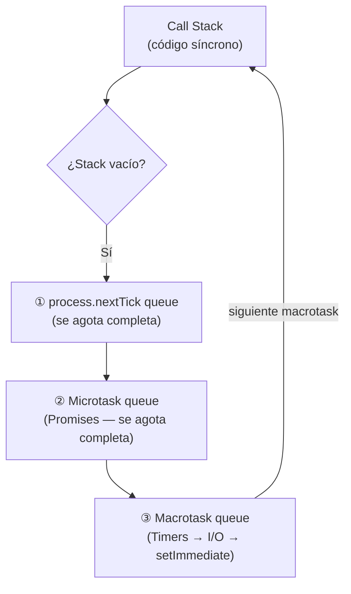

[⬅ Volver al README principal](../README.md)

# 2. JavaScript — Asincronía

*Cómo JavaScript ejecuta código no bloqueante: Promises, async/await y el Event Loop.*

## 2.1 Síncrono vs Asíncrono

**Definición:** código **síncrono** bloquea la ejecución hasta terminar; código **asíncrono** permite que el programa siga mientras una operación (I/O, timer, red) se completa en segundo plano.

**Evolución del lenguaje:** **callbacks** → **Promises** (objeto que representa un valor futuro) → **async/await** (azúcar sintáctico sobre Promises).

```javascript
// Callback (estilo Node: error-first)
fs.readFile("file.txt", "utf8", (err, data) => { if (err) return console.error(err); console.log(data); });

// Promise
fetchUser(1).then(user => console.log(user)).catch(err => console.error(err));

// async/await — mismo comportamiento, más legible
async function run() {
  try { const user = await fetchUser(1); console.log(user); }
  catch (err) { console.error(err); }
}
```

**🔥🔥🔥🔥🔥**

---

## 2.2 Promises

**Definición:** un objeto que representa el resultado eventual (éxito o fallo) de una operación asíncrona.

| Estado | Significa |
|---|---|
| `pending` | Aún no se resolvió ni rechazó |
| `fulfilled` | Se resolvió con éxito (`resolve(value)`) |
| `rejected` | Falló (`reject(error)`) |

`.then()` maneja el éxito, `.catch()` el error, `.finally()` corre siempre. Se pueden encadenar (*Promise chaining*) porque `.then()` retorna una nueva Promise.

### Promise Combinators

| Método | Resuelve con | Rechaza cuando | Cuándo usar |
|---|---|---|---|
| `Promise.all` | Array con todos los valores | **Cualquiera** rechaza (fail-fast) | Necesitas TODOS los resultados |
| `Promise.allSettled` | Array de `{status, value/reason}` | Nunca rechaza | Necesitas el resultado de todas, aunque algunas fallen |
| `Promise.race` | El primero en resolver **o** rechazar | — | Necesitas la más rápida (ej. timeout) |
| `Promise.any` | El primero en **resolver** | Solo si **todas** rechazan (`AggregateError`) | Primera fuente exitosa, de varias redundantes |

```javascript
const p1 = Promise.resolve(1);
const p2 = new Promise((_, rej) => setTimeout(() => rej("fail"), 10));
const p3 = Promise.resolve(3);

Promise.all([p1, p2, p3]).catch(e => console.log("all:", e));               // "all: fail"
Promise.allSettled([p1, p2, p3]).then(r => console.log(r.map(x => x.status))); // ['fulfilled','rejected','fulfilled']
Promise.race([p1, p2, p3]).then(v => console.log("race:", v));              // "race: 1"
Promise.any([p1, p2, p3]).then(v => console.log("any:", v));                // "any: 1"
```

**🔥🔥🔥🔥🔥**

---

## 2.3 Ejecución Secuencial vs Paralela ⚠️

**Definición:** usar `await` uno tras otro ejecuta operaciones **en serie** (el tiempo total se suma); usar `Promise.all` las lanza **en paralelo** (el tiempo total es el de la más lenta).

> 💡 Es un error de rendimiento real y muy común en código de producción — detectarlo demuestra criterio de ingeniería senior.

```javascript
// ❌ SECUENCIAL — ~2s si cada fetch tarda 1s y son independientes
async function sequential() { const a = await fetchA(); const b = await fetchB(); return [a, b]; }

// ✅ PARALELO — ~1s, ambas inician al mismo tiempo
async function parallel() { const [a, b] = await Promise.all([fetchA(), fetchB()]); return [a, b]; }
```

**🔥🔥🔥🔥🔥**

### `forEach` con `async`/`await` — error clásico

```javascript
// ❌ orders siempre queda vacío: forEach no espera callbacks async
async function getUserOrders(userId) {
  const orders = [];
  const ids = await getOrderIds(userId);
  ids.forEach(async (id) => { orders.push(await getOrderById(id)); });
  return orders;
}

// ✅ solución: Promise.all con map
async function getUserOrders(userId) {
  const ids = await getOrderIds(userId);
  return Promise.all(ids.map(id => getOrderById(id)));
}
```

**🔥🔥🔥🔥🔥**

---

## 2.4 Manejo de Errores Asíncronos

```javascript
// ❌ el catch NO atrapa el rechazo — falta await
async function run() {
  try { Promise.reject(new Error("boom")); }
  catch (e) { console.log("caught"); } // nunca se ejecuta
}

// ✅ correcto
async function run() {
  try { await Promise.reject(new Error("boom")); }
  catch (e) { console.log("caught"); } // sí se ejecuta
}
```

`try/catch` solo captura rechazos de promesas que son `await`-adas (o encadenadas con `.catch()`); sin eso, el resultado es un `UnhandledPromiseRejection`.

**🔥🔥🔥🔥🔥**

---

## 2.5 Event Loop

**Definición:** el mecanismo que permite a JS (single-threaded) manejar operaciones asíncronas. El **Call Stack** ejecuta código síncrono. Las operaciones asíncronas (timers, I/O, requests) se delegan a **Web APIs**/libuv, y sus callbacks se encolan: Promises en la **Microtask Queue**, `setTimeout`/I/O/`setImmediate` en la **Macrotask (Callback) Queue**. `process.nextTick` (específico de Node) tiene su propia cola, con **la mayor prioridad de todas**.



```javascript
console.log("A");
setTimeout(() => console.log("B"), 0);          // macrotask
process.nextTick(() => console.log("C"));       // máxima prioridad
Promise.resolve().then(() => console.log("D")); // microtask
console.log("E");
// Orden de ejecución: A, E, C, D, B
```

### Ejemplos de orden de ejecución

```javascript
// Ejemplo 1 — setImmediate siempre es macrotask (fase check), corre al final
setImmediate(() => console.log('immediate'));
process.nextTick(() => console.log('nextTick'));
Promise.resolve().then(() => console.log('promise'));
console.log('sync');
// → sync, nextTick, promise, immediate
```

```javascript
// Ejemplo 2 — el executor de una Promise corre SÍNCRONAMENTE; solo .then() es asíncrono
console.log('A');
new Promise((resolve) => { console.log('B'); resolve(); }).then(() => console.log('C'));
console.log('D');
// → A, B, D, C
```

```javascript
// Ejemplo 3 — una función async siempre retorna una Promise, su .then() es microtask
async function foo() { return 1; }
foo().then(console.log);
console.log('sync');
// → sync, 1
```

**🔥🔥🔥🔥🔥**

---

## 2.6 Race Conditions

**Definición:** un bug causado por el orden/timing impredecible de operaciones concurrentes.

```javascript
// ❌ dos requests leen balance=100 antes de que la primera reste su monto
let balance = 100;
async function withdraw(amount) {
  if (amount <= balance) {
    await simulateDbCall();
    balance -= amount; // ambas pasan la validación → balance termina negativo
  }
}
```

**Solución:** locking (pessimistic/optimistic) o una transacción `Serializable` — ver [sección 7.7](07-sql.md#77-concurrencia-locking-e-isolation-levels).

**🔥🔥🔥🔥**

---

---

[⬅ Volver al README principal](../README.md)
