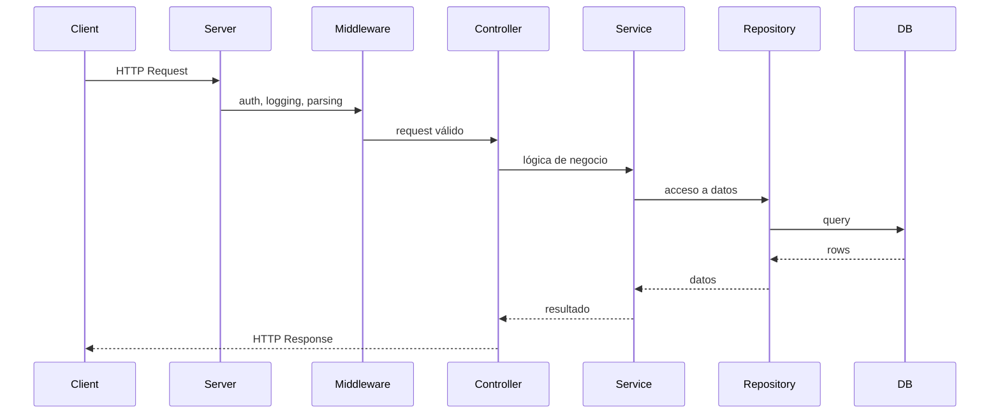

[⬅ Volver al README principal](../README.md)

# 4. Backend Fundamentals

*Los conceptos de HTTP, REST y escalabilidad que sostienen cualquier API, sin importar el framework.*

## 4.1 Client-Server, Request/Response, HTTP/HTTPS

**Anatomía de una request/response:** método + URL (*path params* `/users/:id`, *query params* `?page=2`) + headers + body → el servidor responde con status code + headers + body. **HTTPS** cifra el tráfico en tránsito (TLS) — sin él, cualquier dato, incluidos tokens, viaja en texto plano.

## 4.2 HTTP Methods y Status Codes

| Método | Idempotente | Uso |
|---|---|---|
| GET | ✅ | Leer |
| POST | ❌ | Crear |
| PUT | ✅ | Reemplazar completo |
| PATCH | ⚠️ No garantizado | Actualización parcial |
| DELETE | ✅ | Eliminar |

| Código | Nombre | Cuándo usarlo |
|---|---|---|
| 200 | OK | Éxito general |
| 201 | Created | Recurso creado |
| 204 | No Content | Éxito sin cuerpo (DELETE) |
| 400 | Bad Request | Sintaxis inválida |
| 401 | Unauthorized | No autenticado |
| 403 | Forbidden | Autenticado, sin permisos |
| 404 | Not Found | El recurso no existe |
| 409 | Conflict | Conflicto de estado |
| 422 | Unprocessable Entity | Datos semánticamente inválidos |
| 429 | Too Many Requests | Rate limiting excedido |
| 500 | Internal Server Error | Error inesperado |
| 502 | Bad Gateway | Respuesta inválida de un upstream |
| 503 | Service Unavailable | Servidor sobrecargado/mantenimiento |

**🔥🔥🔥🔥🔥**

## 4.3 JSON, Cookies, Sessions

**JSON:** formato estándar de intercambio de datos. **Cookies:** pequeños datos que el navegador envía automáticamente en cada request al mismo dominio. **Sessions:** estado del usuario guardado en el servidor, referenciado por un ID en una cookie — alternativa stateful a JWT (ver [tabla Session vs JWT](20-tablas-comparativas.md#20-tablas-comparativas)).

## 4.4 REST y Stateless Architecture

**Idempotencia:** repetir la misma request N veces produce el mismo estado final que hacerla una vez.
**Stateless:** cada request contiene toda la información necesaria; el servidor no guarda sesión entre requests (opuesto: *stateful*).

**🔥🔥🔥🔥🔥**

## 4.5 API Versioning, Paginación, Filtering, Sorting, Searching

Se exponen típicamente como query params: `?page=2&limit=20&sort=-createdAt&status=active&q=texto`. El versionado se maneja vía URL (`/v1/users`) o header (`Accept-Version`).

| Estrategia de paginación | Cuándo usar |
|---|---|
| Offset-based (`LIMIT/OFFSET`) | Datasets pequeños/medianos, simplicidad |
| Cursor-based (`WHERE id > lastId`) | Datasets grandes — evita recorrer y descartar filas previas |

## 4.6 Rate Limiting, Caching, Idempotency

- **Rate limiting:** limita cuántas requests puede hacer un cliente en una ventana de tiempo (`429`), típicamente con Redis (`INCR` + `EXPIRE`).
- **Caching:** guardar resultados costosos con TTL para evitar recalcular — ver [sección 8](08-nosql-redis.md#8-nosql-y-redis).
- **Idempotency:** ver [sección 10.8](10-microservicios.md#108-idempotencia-en-microservicios).

## 4.7 Concurrencia y Transacciones

Ver [sección 7](07-sql.md#7-sql-y-bases-de-datos-relacionales) para ACID, locking y race conditions a nivel de base de datos.

## 4.8 Escalabilidad, Disponibilidad y Tolerancia a Fallos

| Concepto | Qué es |
|---|---|
| **Scalability** | Capacidad de manejar más carga agregando recursos |
| **Availability** | % de tiempo que el sistema responde correctamente |
| **Reliability** | El sistema se comporta correctamente de forma consistente |
| **Fault Tolerance** | El sistema sigue funcionando aunque un componente falle |
| **High Availability (HA)** | Diseño explícito para minimizar downtime (redundancia, failover) |
| **Load Balancing** | Distribuye tráfico entre múltiples instancias |

| Horizontal vs Vertical Scaling | Diferencia |
|---|---|
| **Vertical** | Agregar más recursos (CPU/RAM) a una sola máquina — límite físico, downtime al escalar |
| **Horizontal** | Agregar más máquinas/instancias — requiere stateless + load balancer, escala casi sin límite |

**🔥🔥🔥🔥**

---

---

[⬅ Volver al README principal](../README.md)
