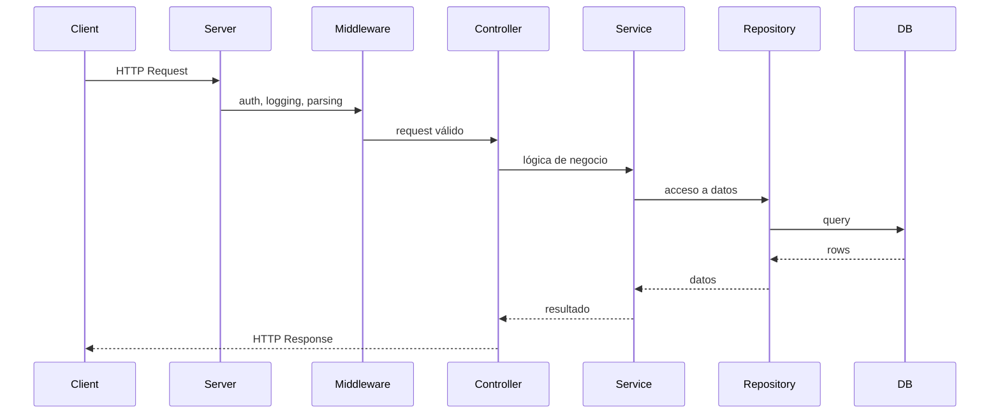

[⬅ Volver al README principal](../README.md)

# 4. Backend Fundamentals

*Los conceptos de HTTP, REST y escalabilidad que sostienen cualquier API, sin importar el framework.*

## 4.1 Client-Server, Request/Response, HTTP/HTTPS

**Anatomía de una request/response:** método + URL (*path params* `/users/:id`, *query params* `?page=2`) + headers + body → el servidor responde con status code + headers + body. **HTTPS** cifra el tráfico en tránsito (TLS) — sin él, cualquier dato, incluidos tokens, viaja en texto plano.



## 4.2 HTTP Methods y Status Codes

| Método | Idempotente | Uso |
|---|---|---|
| GET | ✅ | Leer |
| POST | ❌ | Crear |
| PUT | ✅ | Reemplazar completo |
| PATCH | ⚠️ No garantizado | Actualización parcial |
| DELETE | ✅ | Eliminar |

| Código | Nombre | Cuándo usarlo | Ejemplo |
|---|---|---|---|
| 200 | OK | Éxito general en una petición que devuelve datos (GET, PUT, PATCH) | `GET /users/1` devuelve el usuario con status 200 |
| 201 | Created | Se creó un recurso nuevo exitosamente, normalmente tras un POST | `POST /users` crea un usuario y responde 201 con el nuevo recurso (y su `Location`) |
| 204 | No Content | La operación fue exitosa pero no hay nada que devolver en el cuerpo | `DELETE /users/1` responde 204 sin body |
| 400 | Bad Request | El cliente envió una petición mal formada o con sintaxis inválida (antes de validar reglas de negocio) | Enviar `{ "edad": "abc" }` cuando se espera un número, o un JSON malformado |
| 401 | Unauthorized | El cliente no se autenticó (falta token o es inválido) — a pesar del nombre, es "no identificado" | Llamar a un endpoint protegido sin header `Authorization` o con un token expirado |
| 403 | Forbidden | El cliente está autenticado, pero no tiene permisos para esa acción | Un usuario normal intenta acceder a `/admin/reportes` |
| 404 | Not Found | El recurso solicitado no existe (o se oculta por seguridad) | `GET /users/999` cuando no existe el usuario con id 999 |
| 409 | Conflict | La petición entra en conflicto con el estado actual del recurso | Intentar crear un usuario con un email que ya está registrado |
| 422 | Unprocessable Entity | La sintaxis es válida (es JSON correcto), pero los datos no cumplen las reglas de negocio/validación | Enviar `{ "email": "no-es-un-email" }`: el JSON es válido pero el formato del campo no |
| 429 | Too Many Requests | El cliente superó el límite de peticiones permitido (rate limiting) | Hacer 1000 requests/minuto a una API que limita a 100/minuto |
| 500 | Internal Server Error | Ocurrió un error no controlado en el servidor | Una excepción sin capturar al leer una propiedad de `undefined` en el backend |
| 502 | Bad Gateway | El servidor actuó como proxy/gateway y recibió una respuesta inválida de un servicio upstream | El API Gateway llama a un microservicio que está caído y responde con basura |
| 503 | Service Unavailable | El servidor no puede atender la petición temporalmente (sobrecarga, mantenimiento, deploy) | El servidor está reiniciando o se alcanzó el límite de conexiones y rechaza nuevas peticiones |

**🔥🔥🔥🔥🔥**

## 4.3 JSON, Cookies, Sessions

**JSON:** formato estándar de intercambio de datos, basado en texto y legible por humanos (`{"id": 1, "active": true}`). **Cookies:** pequeños datos (máx. ~4KB) que el navegador guarda y envía automáticamente en cada request al mismo dominio. **Sessions:** estado del usuario guardado en el servidor (en memoria o Redis), referenciado por un ID opaco en una cookie — alternativa stateful a JWT (ver [tabla Session vs JWT](20-tablas-comparativas.md#20-tablas-comparativas)).

```javascript
app.post('/login', async (req, res) => {
  const sessionId = crypto.randomUUID();
  await redis.set(`session:${sessionId}`, JSON.stringify({ userId: user.id }), 'EX', 3600);
  res.cookie('sessionId', sessionId, { httpOnly: true, secure: true }); // el navegador la reenvía sola
});

app.get('/me', async (req, res) => {
  const session = await redis.get(`session:${req.cookies.sessionId}`); // el servidor "recuerda" al usuario
  if (!session) return res.sendStatus(401);
  res.json(JSON.parse(session));
});
```

## 4.4 REST y Stateless Architecture

**Idempotencia:** repetir la misma request N veces produce el mismo estado final que hacerla una vez.
**Stateless:** cada request contiene toda la información necesaria; el servidor no guarda sesión entre requests (opuesto: *stateful*).

**🔥🔥🔥🔥🔥**

## 4.5 API Versioning, Paginación, Filtering, Sorting, Searching

Se exponen típicamente como query params: `?page=2&limit=20&sort=-createdAt&status=active&q=texto`. El versionado se maneja vía URL (`/v1/users`) o header (`Accept-Version`).

| Estrategia de paginación | Cuándo usar |
|---|---|
| Offset-based (`LIMIT/OFFSET`) | Datasets pequeños/medianos, simplicidad |
| Cursor-based (`WHERE id > lastId`) | Datasets grandes — evita recorrer y descartar filas previas |

## 4.6 Rate Limiting, Caching, Idempotency

- **Rate limiting:** limita cuántas requests puede hacer un cliente en una ventana de tiempo (`429`), típicamente con Redis (`INCR` + `EXPIRE`).
- **Caching:** guardar resultados costosos con TTL para evitar recalcular — ver [sección 8](08-nosql-redis.md#8-nosql-y-redis).
- **Idempotency:** ver [sección 10.8](10-microservicios.md#108-idempotencia-en-microservicios).

## 4.7 Concurrencia y Transacciones

Ver [sección 7](07-sql.md#7-sql-y-bases-de-datos-relacionales) para ACID, locking y race conditions a nivel de base de datos.

## 4.8 Escalabilidad, Disponibilidad y Tolerancia a Fallos

| Concepto | Qué es |
|---|---|
| **Scalability** | Capacidad de manejar más carga agregando recursos |
| **Availability** | % de tiempo que el sistema responde correctamente |
| **Reliability** | El sistema se comporta correctamente de forma consistente |
| **Fault Tolerance** | El sistema sigue funcionando aunque un componente falle |
| **High Availability (HA)** | Diseño explícito para minimizar downtime (redundancia, failover) |
| **Load Balancing** | Distribuye tráfico entre múltiples instancias |

| Horizontal vs Vertical Scaling | Diferencia |
|---|---|
| **Vertical** | Agregar más recursos (CPU/RAM) a una sola máquina — límite físico, downtime al escalar |
| **Horizontal** | Agregar más máquinas/instancias — requiere stateless + load balancer, escala casi sin límite |

**🔥🔥🔥🔥**

---

---

[⬅ Volver al README principal](../README.md)
