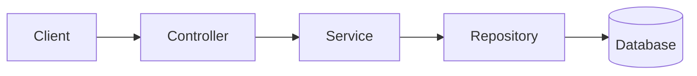

[⬅ Volver al README principal](../README.md)

# 9. Arquitectura Backend

*Cómo organizar el código de un servicio para que escale en complejidad sin volverse imposible de mantener.*

## 9.1 Layered Architecture y Separation of Concerns



Cada capa tiene una única responsabilidad: el **Controller** maneja HTTP, el **Service** contiene las reglas de negocio, el **Repository** encapsula el acceso a datos. Ninguna capa debería "saltarse" a otra (ej. el Controller no debería hacer queries SQL directamente).

**🔥🔥🔥🔥**

## 9.2 Clean Architecture y Hexagonal Architecture

**Definición:** ambos estilos ponen la **lógica de negocio en el centro**, aislada de frameworks, bases de datos y detalles de infraestructura, que quedan como "adaptadores" intercambiables en el borde.

| Estilo | Idea central |
|---|---|
| **Clean Architecture** | Capas concéntricas; las dependencias siempre apuntan hacia adentro (el dominio no conoce la infraestructura) |
| **Hexagonal (Ports & Adapters)** | El dominio define *ports* (interfaces); los *adapters* (HTTP, DB, cola) los implementan desde afuera |

> 💡 El beneficio práctico: puedes cambiar de PostgreSQL a MongoDB, o de Express a Fastify, sin tocar la lógica de negocio — porque esta nunca dependió directamente de esos detalles.

```javascript
// El dominio define el "port" (una interfaz), sin saber qué lo implementa
class OrderRepositoryPort { async save(order) { throw new Error('no implementado'); } }

// Un "adapter" concreto implementa ese port contra una tecnología específica
class PostgresOrderRepository extends OrderRepositoryPort {
  async save(order) { return db.query('INSERT INTO orders ...', [order]); }
}

// La lógica de negocio solo conoce el port — se le inyecta el adapter desde afuera
class CreateOrderUseCase {
  constructor(orderRepository) { this.orderRepository = orderRepository; } // recibe el port
  async execute(data) { return this.orderRepository.save(data); }
}
// Cambiar de Postgres a MongoDB = escribir un nuevo adapter; CreateOrderUseCase no cambia
```

## 9.3 Domain-Driven Design (DDD) y Bounded Context

**Definición:** DDD modela el software alrededor del dominio de negocio real, usando el mismo lenguaje que usan los expertos del negocio ("lenguaje ubicuo"). Un **Bounded Context** es el límite explícito donde un modelo de dominio es válido y consistente — el mismo término (ej. "Cliente") puede significar algo distinto en el contexto de Ventas que en el de Soporte.

```
Bounded Context "Ventas"          Bounded Context "Soporte"
┌─────────────────────┐          ┌─────────────────────┐
│ Cliente              │          │ Cliente              │
│ - historial de       │          │ - tickets abiertos   │
│   compras             │          │ - nivel de SLA       │
│ - límite de crédito   │          │ - agente asignado     │
└─────────────────────┘          └─────────────────────┘
```
Es el MISMO término de negocio ("Cliente"), pero cada contexto solo modela los atributos que le importan a ESE dominio — intentar unificarlo en una sola entidad gigante compartida termina acoplando equipos que no deberían depender entre sí.

**🔥🔥🔥**

## 9.4 Principios SOLID

| Principio | Qué dice | Ejemplo rápido |
|---|---|---|
| **S** — Single Responsibility | Una clase/módulo debe tener una sola razón para cambiar | Separar `OrderService` (lógica) de `OrderRepository` (datos) |
| **O** — Open/Closed | Abierto a extensión, cerrado a modificación | Agregar un nuevo método de pago sin tocar el código existente de los anteriores |
| **L** — Liskov Substitution | Una subclase debe poder sustituir a su clase base sin romper el comportamiento esperado | Si `Square extends Rectangle`, no debería alterar el contrato de `setWidth`/`setHeight` |
| **I** — Interface Segregation | Mejor varias interfaces pequeñas que una grande y genérica | No forzar a un cliente a implementar métodos que no usa |
| **D** — Dependency Inversion | Depender de abstracciones, no de implementaciones concretas | Un `Service` depende de una interfaz `Repository`, no de una clase `PostgresRepository` específica |

```javascript
// ❌ viola Dependency Inversion: el service está acoplado a Postgres directamente
class OrderService { constructor() { this.db = new PostgresConnection(); } }

// ✅ depende de una abstracción, inyectada desde afuera
class OrderService { constructor(repository) { this.repository = repository; } }
```

**🔥🔥🔥🔥**

## 9.5 Dependency Injection, Repository y Service Layer

Ver el detalle de cada patrón, con cuándo usarlo y cuándo no, en la [sección 17 — Patrones de Diseño para Backend](17-patrones-diseno.md#17-patrones-de-diseño-para-backend).

---

---

[⬅ Volver al README principal](../README.md)
