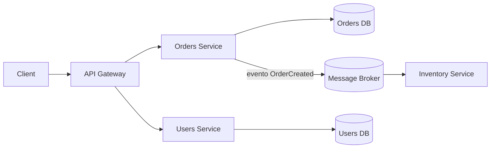
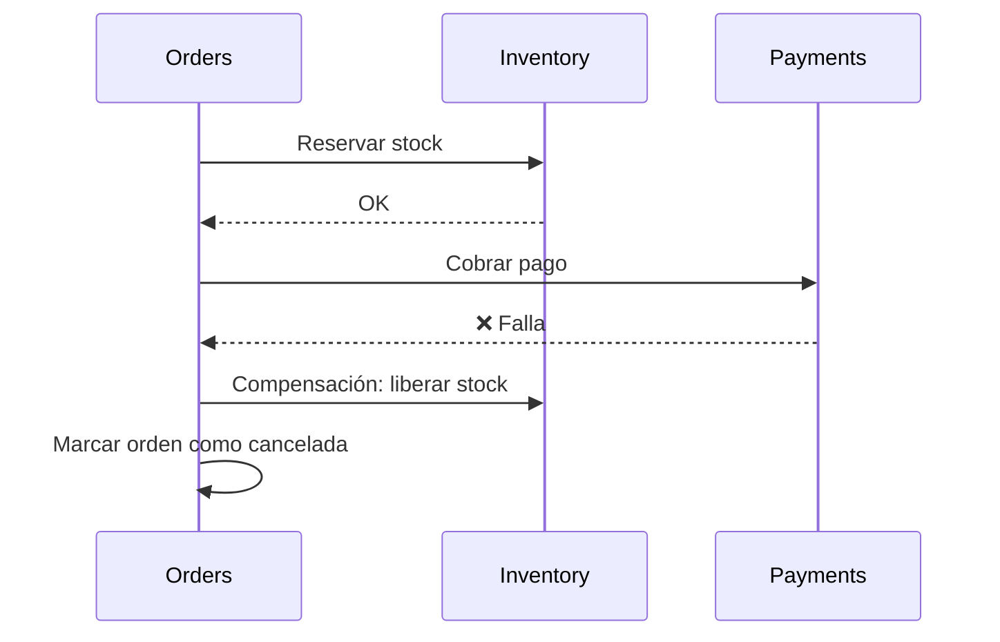
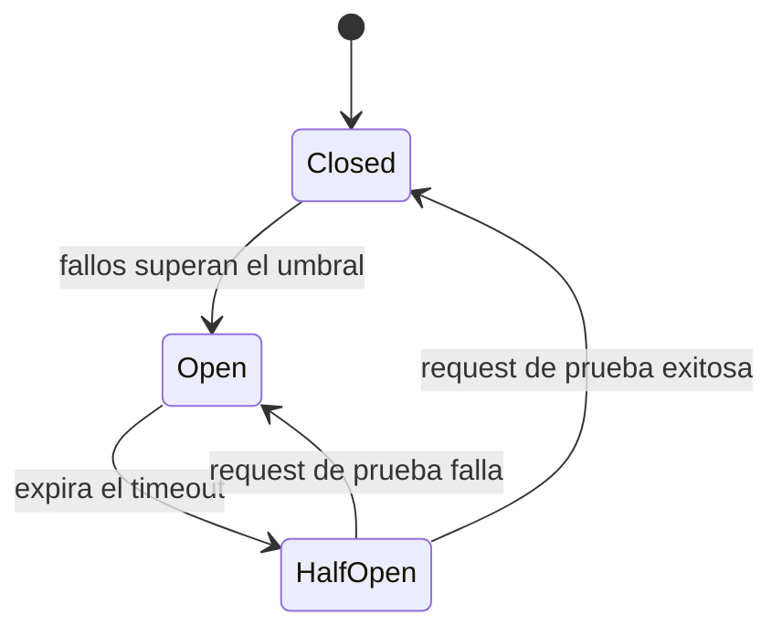
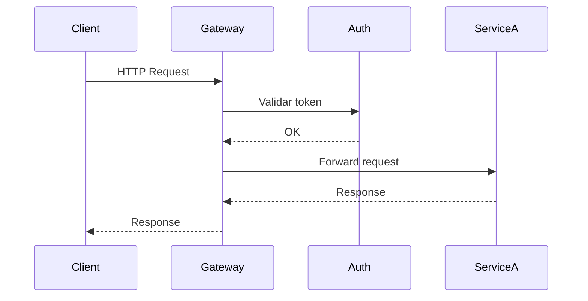

[⬅ Volver al README principal](../README.md)

# 10. Microservicios

*Cómo dividir un sistema en servicios independientes, cómo se comunican, y cómo sobreviven a fallos parciales.*

## 10.1 Monolito vs Microservicios

| Concepto | Qué es |
|---|---|
| **Monolito** | Una sola aplicación/deploy con toda la lógica de negocio |
| **Monolito modular** | Un solo deploy, pero con módulos internos bien separados por dominio |
| **Microservicios** | Servicios pequeños e independientes, cada uno con su propio deploy, escalado y base de datos |

| Ventajas de Microservicios | Desventajas de Microservicios |
|---|---|
| Escalado independiente por servicio | Mayor complejidad operativa (deploys, monitoreo, red) |
| Equipos autónomos, deploys independientes | Comunicación entre servicios añade latencia y puntos de falla |
| Fallos aislados (en teoría) | Transacciones distribuidas son difíciles (no hay `COMMIT` global) |
| Tecnología distinta por servicio si se necesita | Requiere buena observabilidad (tracing, logging centralizado) |

**Cuándo usar microservicios:** equipos grandes que necesitan desplegar independientemente, dominios de negocio bien definidos (bounded contexts), necesidad real de escalar partes específicas del sistema de forma distinta.

**Cuándo NO usarlos:** equipos pequeños, producto en etapa temprana (el dominio aún cambia mucho), sin experiencia operando sistemas distribuidos — un monolito modular suele ser más rápido de construir y mantener.

**Ejemplo concreto — una tienda online:**
- **Monolito:** un único proceso Express con carpetas `/users`, `/orders`, `/payments`, todas contra la misma base de datos — un solo `npm run deploy` actualiza todo.
- **Microservicios:** `users-service`, `orders-service` y `payments-service` corren como procesos separados, cada uno con su propia base de datos, desplegables y escalables de forma independiente (ej. `payments-service` puede tener 10 réplicas en Black Friday mientras `users-service` se queda con 2).

**🔥🔥🔥🔥🔥**

## 10.2 Service Decomposition y Bounded Context

**Definición:** dividir el sistema según límites de dominio de negocio (bounded contexts, ver [sección 9.3](09-arquitectura-backend.md#93-domain-driven-design-ddd-y-bounded-context)), no según capas técnicas. Un buen límite de servicio agrupa datos y lógica que cambian juntos, minimizando llamadas cruzadas constantes entre servicios.

```
❌ Dividir por capa técnica: "frontend-api-service", "database-service", "validation-service"
   → casi cada feature nueva toca los tres servicios a la vez (alto acoplamiento)

✅ Dividir por dominio de negocio: "orders-service", "inventory-service", "payments-service"
   → una feature de "cancelar orden" vive mayormente dentro de orders-service
```

## 10.3 Database per Service vs Shared Database

| Enfoque | Ventajas | Problemas |
|---|---|---|
| **Database per service** | Cada servicio evoluciona su esquema independientemente | Requiere Saga/eventos para consistencia entre servicios |
| **Shared database** | Más simple al inicio, JOINs cross-dominio triviales | Acopla fuertemente los servicios — anti-patrón en microservicios |

```
❌ Shared database:
   orders-service ──┐
   payments-service ─┼──> [ misma base de datos: tabla orders, tabla payments ]
   inventory-service ┘       (cualquier servicio puede leer/escribir cualquier tabla)

✅ Database per service:
   orders-service     ──> [ orders_db ]
   payments-service   ──> [ payments_db ]
   inventory-service  ──> [ inventory_db ]
   (si payments-service necesita datos de una orden, los pide vía API o los recibe por evento)
```

**🔥🔥🔥🔥**

## 10.4 Comunicación entre Servicios



| Tipo | Ejemplos | Cuándo usar |
|---|---|---|
| **Síncrona** | REST, gRPC | El caller necesita la respuesta inmediata para continuar |
| **Asíncrona** | Message brokers (RabbitMQ, Kafka, SQS) | Desacoplar servicios, procesar en background |

**REST vs gRPC:** REST usa HTTP/JSON, legible y ampliamente soportado; gRPC usa HTTP/2 + Protocol Buffers (binario), más rápido y eficiente, pero menos "humano" de depurar — común en comunicación interna de alto volumen.

⚠️ Demasiada comunicación síncrona entre microservicios crea un **"distributed monolith"**: servicios acoplados que deben estar todos arriba al mismo tiempo, perdiendo el beneficio principal de la arquitectura.

**🔥🔥🔥🔥🔥**

## 10.5 Consistencia y Saga Pattern

| Concepto | Diferencia |
|---|---|
| **Strong consistency** | Toda lectura ve el dato más reciente escrito, inmediatamente |
| **Eventual consistency** | Los datos replicados convergen con el tiempo — trade-off común a cambio de disponibilidad |

**Saga Pattern:** maneja transacciones distribuidas como una secuencia de transacciones **locales**, cada una con una **acción compensatoria** si un paso posterior falla (no existe un `COMMIT`/`ROLLBACK` global entre bases de datos distintas).



| Saga Choreography | Saga Orchestration |
|---|---|
| Cada servicio escucha eventos y decide su siguiente paso de forma autónoma | Un orquestador central coordina y dirige cada paso explícitamente |
| Sin punto único de fallo, pero el flujo completo es difícil de visualizar | Flujo centralizado y fácil de seguir, pero el orquestador es un punto crítico |
| Buena para pocos pasos simples | Mejor para flujos largos con muchos pasos y lógica de compensación compleja |

**🔥🔥🔥🔥🔥**

## 10.6 Resiliencia



| Patrón | Qué problema resuelve | Cuándo usarlo |
|---|---|---|
| **Timeout** | Evita esperar indefinidamente la respuesta de otro servicio | Siempre, en toda llamada de red |
| **Retry** | Reintenta una operación que falló por un error transitorio | Errores transitorios, operaciones idempotentes |
| **Exponential Backoff** | Espera creciente entre reintentos, para no saturar un servicio degradado | Siempre que se implementen retries |
| **Circuit Breaker** | Deja de llamar a un servicio que falla repetidamente, evitando cascading failures | Dependencias externas que pueden degradarse |
| **Bulkhead** | Aísla recursos (pools de conexión/threads) por dependencia | Múltiples dependencias con distinta criticidad/latencia |
| **Backpressure** | El consumidor señala al productor que reduzca el ritmo cuando no da abasto | Streams, colas con productores más rápidos que los consumidores |
| **Dead Letter Queue** | Aísla mensajes que fallan repetidamente, para no bloquear la cola principal | Consumidores con mensajes "envenenados" que nunca procesan con éxito |

El Circuit Breaker resuelve algo que un simple `try/catch` con retry no resuelve: evita **seguir intentando** llamar a un servicio que ya sabemos caído — un retry simple generaría carga adicional sobre un servicio ya degradado.

**🔥🔥🔥🔥🔥**

## 10.7 Service Discovery, API Gateway y Configuración



- **Service Discovery:** mecanismo para que los servicios se encuentren dinámicamente (Consul, Eureka, DNS interno de Kubernetes) — necesario porque las IPs cambian constantemente en un entorno orquestado.
- **API Gateway:** punto de entrada único que enruta, autentica, aplica rate limiting y a veces agrega respuestas de varios servicios.
- **Centralized configuration:** configuración gestionada en un solo lugar en vez de hardcodeada por servicio.

**🔥🔥🔥**

## 10.8 Idempotencia en Microservicios

**Definición:** procesar el mismo mensaje/request más de una vez no debe cambiar el resultado final. Es crítico porque los sistemas distribuidos suelen garantizar "at-least-once delivery".

```javascript
app.post('/payments', async (req, res) => {
  const { idempotencyKey, amount, userId } = req.body;
  const existing = await db.findPaymentByIdempotencyKey(idempotencyKey);
  if (existing) return res.status(200).json(existing); // ya procesado

  const payment = await chargeCard(userId, amount);
  await db.savePayment({ idempotencyKey, ...payment });
  res.status(201).json(payment);
});
```

Confiar en que "el cliente no debería reintentar" es un error de diseño común — en sistemas distribuidos los reintentos son inevitables (timeouts, fallos de red); hay que diseñar para que sean seguros por default.

**🔥🔥🔥🔥🔥**

## 10.9 Patrones Importantes en Microservicios

| Patrón | Qué problema resuelve | Cuándo usarlo |
|---|---|---|
| **API Gateway** | Evita que el cliente deba conocer y llamar directamente a N microservicios | Casi siempre que hay servicios expuestos a clientes externos |
| **Saga** | Mantiene consistencia en transacciones multi-servicio sin transacción distribuida real | Flujos de negocio multi-servicio (checkout, reservas) |
| **Outbox Pattern** | Evita inconsistencia entre "guardar un cambio" y "publicar su evento" | Garantizar que un evento se publique si y solo si la transacción local se confirmó |
| **CQRS** | Separa el modelo de escritura del de lectura, optimizando cada uno por separado | Lecturas con patrones muy distintos a las escrituras |
| **Event Sourcing** | Guarda la secuencia completa de eventos en vez de solo el estado actual | Auditoría completa, reconstrucción de estado en cualquier punto del tiempo |
| **Strangler Fig** | Migra gradualmente un monolito a microservicios, sin un "big bang" | Migraciones de sistemas legacy grandes y críticos |

```sql
-- Outbox Pattern: el evento se guarda en la MISMA transacción que el dato
BEGIN;
INSERT INTO orders (id, user_id, status) VALUES (123, 'u1', 'created');
INSERT INTO outbox (event_type, payload) VALUES ('OrderCreated', '{"orderId": 123}');
COMMIT;
-- Un proceso separado lee la tabla outbox y publica a Kafka/RabbitMQ,
-- garantizando que el evento no se pierda aunque el broker esté caído en ese instante.
```

**🔥🔥🔥🔥**

---

---

[⬅ Volver al README principal](../README.md)
