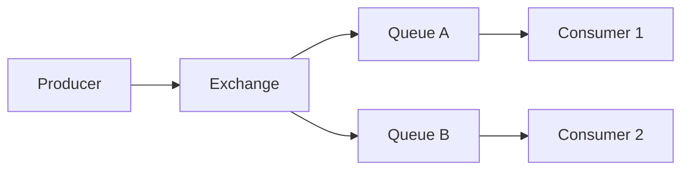
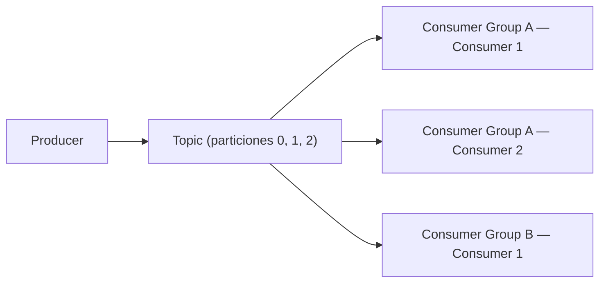

[⬅ Volver al README principal](../README.md)

# 11. Message Brokers

*La capa de mensajería que permite comunicación asíncrona y desacoplada entre servicios.*

## 11.1 Conceptos Fundamentales

| Concepto | Qué es |
|---|---|
| **Producer** | Publica un mensaje/evento |
| **Consumer** | Procesa mensajes de una cola/tópico |
| **Message** | El dato transportado |
| **Event** | Notifica que algo *ya ocurrió* (`OrderCreated`) |
| **Command** | Pide que algo *ocurra* (`ChargePayment`) — implica una acción esperada |
| **Acknowledgement (ACK)** | El consumer confirma al broker que procesó el mensaje con éxito |
| **Message Ordering** | Garantía (o no) de que los mensajes se procesan en el mismo orden en que se publicaron |

```javascript
// Producer: publica un EVENTO — algo que ya ocurrió, otros servicios deciden si reaccionar
await broker.publish('order.created', { orderId: 42, total: 99.90 });

// Consumer: procesa el mensaje y confirma (ACK) solo si terminó con éxito
broker.subscribe('order.created', async (message) => {
  await inventoryService.reserveStock(message.orderId);
  message.ack(); // sin ACK, el broker reintentará entregar este mensaje más tarde
});
```

## 11.2 Garantías de Entrega

| Garantía | Qué significa | Riesgo |
|---|---|---|
| **At-most-once** | El mensaje se entrega 0 o 1 vez | Puede perderse |
| **At-least-once** | El mensaje se entrega 1 o más veces | Puede duplicarse — requiere **idempotent consumers** |
| **Exactly-once** | El mensaje se procesa exactamente una vez | El más difícil de garantizar end-to-end; rara vez 100% real en sistemas distribuidos |

Los consumidores deben diseñarse como **idempotentes** por default: dado que la mayoría de brokers garantizan at-least-once, reprocesar el mismo mensaje no debe producir un resultado distinto (ver [idempotencia en microservicios](10-microservicios.md#108-idempotencia-en-microservicios)).

**🔥🔥🔥🔥🔥**

## 11.3 RabbitMQ



**Definición:** broker de mensajería tradicional basado en colas. Un *Exchange* enruta mensajes a una o más *Queues* según reglas (direct, topic, fanout). Cada mensaje en una queue lo procesa **un solo** consumidor (punto a punto) — ideal para distribuir trabajo entre workers.

## 11.4 Apache Kafka



**Definición:** plataforma de streaming de eventos basada en un log distribuido. Los mensajes se publican a un **Topic**, dividido en **Partitions** para paralelismo; cada partición mantiene su mensajes ordenados, identificados por un **Offset** incremental. Múltiples **Consumer Groups** pueden leer el mismo topic de forma independiente, cada uno con su propio progreso (offset).

| Concepto Kafka | Qué es |
|---|---|
| **Partition** | Subdivisión de un topic, permite paralelismo y escalado horizontal |
| **Consumer Group** | Conjunto de consumers que se reparten las particiones de un topic entre sí |
| **Offset** | Posición del consumer dentro de una partición — permite reanudar donde se quedó |

## 11.5 RabbitMQ vs Kafka

| | RabbitMQ | Kafka |
|---|---|---|
| **Modelo** | Cola tradicional (push), mensaje se borra tras ACK | Log distribuido (pull), mensajes persisten según retención configurada |
| **Múltiples consumers** | Un mensaje lo procesa un solo consumer por queue | Múltiples consumer groups leen el mismo topic independientemente |
| **Orden** | Por queue | Garantizado solo dentro de una misma partición |
| **Throughput** | Alto, pero menor que Kafka en volúmenes masivos | Diseñado para volúmenes muy altos (streaming de eventos) |
| **Caso de uso típico** | Colas de tareas, RPC, enrutamiento complejo | Event sourcing, streaming, pipelines de datos, replay de eventos |

**🔥🔥🔥🔥**

## 11.6 Dead Letter Queue

**Definición:** cola secundaria donde se envían mensajes que fallaron repetidamente al procesarse (tras N reintentos), para que no bloqueen indefinidamente la cola principal y puedan inspeccionarse/reprocesarse manualmente.

```javascript
broker.subscribe('payment.process', async (message) => {
  try {
    await chargeCard(message.payload);
    message.ack();
  } catch (err) {
    if (message.deliveryCount >= 5) {
      await deadLetterQueue.send(message); // mensaje "envenenado": lo sacamos de la cola principal
      message.ack();
    } else {
      message.nack(); // reintentar más tarde
    }
  }
});
```

Sin DLQ, un mensaje que siempre falla (ej. datos corruptos) bloquearía el procesamiento de **todos** los mensajes detrás de él en la misma cola.

**🔥🔥🔥**

---

---

[⬅ Volver al README principal](../README.md)
