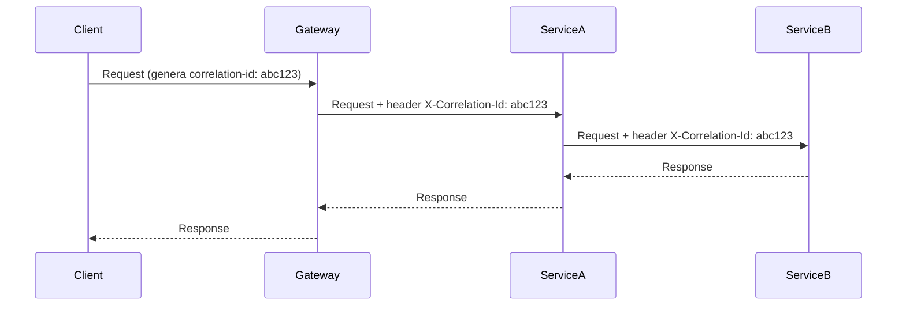

[⬅ Volver al README principal](../README.md)

# 14. Observabilidad

*Cómo entender qué está pasando dentro de un sistema en producción, especialmente cuando algo falla.*

## 14.1 Logging

| Nivel de log | Cuándo usarlo |
|---|---|
| **Debug** | Detalle técnico útil solo en desarrollo |
| **Info** | Eventos normales del flujo de la aplicación |
| **Warn** | Algo inesperado, pero no crítico |
| **Error** | Un fallo que requiere atención |

**Structured logging:** registrar logs como JSON (campos clave-valor) en vez de texto libre, para poder buscar/filtrar/agregar en herramientas como Datadog o ELK.

```javascript
// ❌ texto libre, difícil de buscar/agregar
console.log('Usuario ' + userId + ' falló al pagar');

// ✅ structured logging — fácil de indexar y filtrar
logger.error('payment_failed', { userId, orderId, amount, reason: 'card_declined' });
```

**🔥🔥🔥🔥**

## 14.2 Métricas y Monitoring

**Métricas** clave de un servicio backend: latencia, tasa de error, throughput (requests/segundo) — típicamente recolectadas con Prometheus y visualizadas en Grafana.

## 14.3 Distributed Tracing y Correlation ID

**Definición:** un identificador único (`correlation ID` / `trace ID`) viaja con la request a través de todos los servicios que la procesan, permitiendo reconstruir el flujo completo en herramientas como Jaeger o OpenTelemetry.



El correlation ID se genera normalmente en el API Gateway y se propaga en los headers a cada servicio downstream, apareciendo en todos los logs relacionados a esa request.

**🔥🔥🔥🔥**

## 14.4 Health Checks, APM, Error Tracking, Alerting

- **Health Checks:** endpoints (`/health`) que reportan si un servicio está operativo, usados por el orquestador/load balancer.
- **APM** (Application Performance Monitoring): herramientas (Datadog APM, New Relic) que correlacionan latencia, errores y trazas automáticamente.
- **Error Tracking:** captura y agrupa excepciones en producción con contexto (Sentry, Bugsnag).
- **Alerting:** notificaciones automáticas cuando una métrica cruza un umbral (ej. tasa de error > 5%).

**🔥🔥🔥**

---

---

[⬅ Volver al README principal](../README.md)
